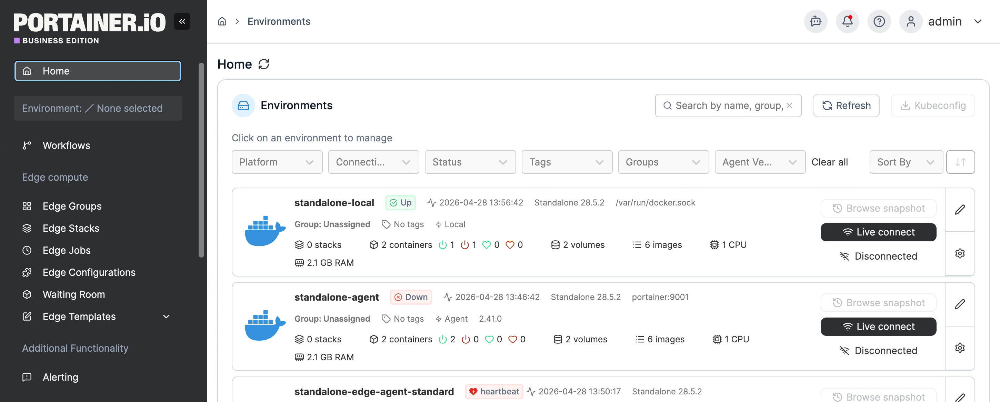

---
metaLinks:
  alternates:
    - https://app.gitbook.com/s/Dalese9Lv4CX6YKS1s45/admin/recommendations
---

# Recommendations


Recommendations is only available in [Portainer Business Edition](https://www.portainer.io/business-upsell?from=stack-webhook).



Recommendations is an administrator-only feature. It is not visible to standard users.


Recommendations help you make the most out of your Portainer setup by surfacing actionable suggestions when it detects environment issues or Portainer configuration that may indicate misuse, misconfiguration, or missed best practices.

From the menu select **Recommendations** under the **Administration** section.

<figure><figcaption></figcaption></figure>

The page displays all active issues or recommendations for your Portainer server. Each recommendation includes a title and an explanation, as well as an action button that navigates you directly to the relevant area of Portainer to resolve it.

Recommendations are evaluated periodically in the background and also when relevant configuration changes occur (such as changes to users, environments, or policies). The list updates automatically.

The following are issues or recommendations that can be surfaced:

Environments offline

**Severity:** Critical

**Trigger condition:** At least one environment is currently unreachable, or has not sent a heartbeat within the expected interval.

An offline environment means Portainer has lost contact with that endpoint and cannot deploy, manage, or monitor workloads running there. This may indicate a network issue, a crashed agent, or a problem with the host itself. Because this directly affects operational visibility and control, it is treated as a critical issue requiring prompt attention.

**Action:** Click **View** to navigate to the environment list.

Too many administrators

**Severity:** Warning

**Trigger condition:** Your Portainer instance has more than 10 users, and more than 20% of those users have the Administrator role.

Portainer administrators have unrestricted access to all environments, settings, and resources. A high ratio of admins relative to total users is a common sign that role assignment has not been reviewed, and increases the risk of unintended or unauthorised changes. Standard users with environment-level access should be preferred for day-to-day operations.

**Action:** Click **View Users** to navigate to the user list to review and adjust role assignments.

Groups without policies

**Severity:** Warning

**Trigger condition:** At least one environment belongs to a group that does not have a governance policy attached to it.

Without a governance policy, there are no enforced controls over what can be deployed to those environments. This creates a compliance and security risk, particularly in regulated or production environments.

**Action:** Click **View Groups** to navigate to the groups list.

Agents needs upgrading

**Severity:** Warning

**Trigger condition:** At least one environment is connected via an agent running a version older than 2.37.

Outdated agents may lack support for newer Portainer features and may present compatibility or security risks. Keeping agents up to date ensures full functionality and supportability.

**Action:** Click **View** to navigate to the environment list.

Policies are unattached

**Severity:** Info

**Trigger condition:** At least one governance policy exists but is not attached to any environment group.

Unattached policies have no effect. If a policy was created with the intent of governing environments, it should be assigned to the relevant group. If the policy is no longer needed, consider removing it to keep your configuration clean.

**Action:** Click **View Policies** to navigate to the policy list.

Unassigned environments

**Severity:** Warning

**Trigger condition:** At least one environment is in the Unassigned group.

Environments in the Unassigned group are not subject to any governance policy and cannot be managed as part of a logical fleet. Grouping environments is a prerequisite for applying governance and access controls consistently.

**Action:** Click **View Environments** to navigate to the environment list.

