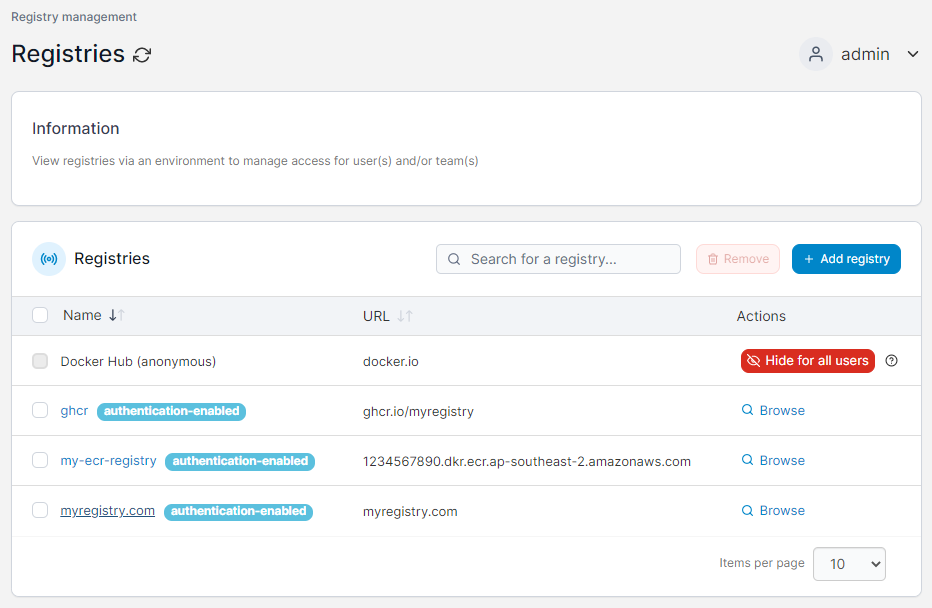
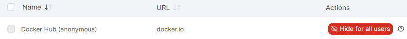

# Registries

A registry is a repository of container images that can be pulled and deployed on a containerized infrastructure. Portainer supports connecting registries to the Portainer Server instance, allowing you to use those registries when deploying containers.

<figure><figcaption></figcaption></figure>


[add](add/)



[custom.md](add/custom.md)


With Portainer Business Edition you can also browse and manage your registries within Portainer itself.


[browse.md](browse.md)



[manage.md](manage.md)


## Hiding anonymous Docker Hub

By default the **Docker Hub (anonymous)** registry is available to all users. If you would prefer to hide this from the registry selection, you can click **Hide for all users**.

<figure><figcaption></figcaption></figure>


As the anonymous Docker Hub access is built into Docker itself this does not fully disable access to this registry, but it does hide it from the dropdown list of registries in the Portainer UI. In addition, if no other registries are available to a user the Docker Hub (anonymous) option will be displayed regardless of this setting.

