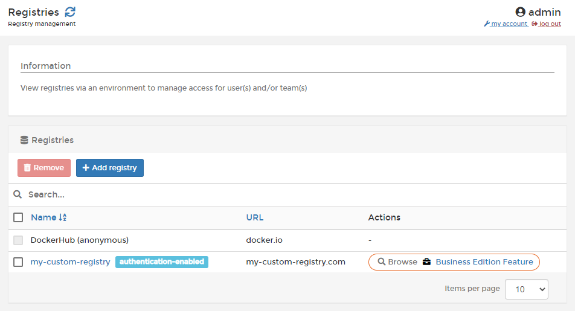

# Registries

A registry is a repository of container images that can be pulled and deployed on a containerized infrastructure. Portainer supports connecting registries to the Portainer Server instance, allowing you to use those registries when deploying containers.


[add](add/)



[custom.md](add/custom.md)


