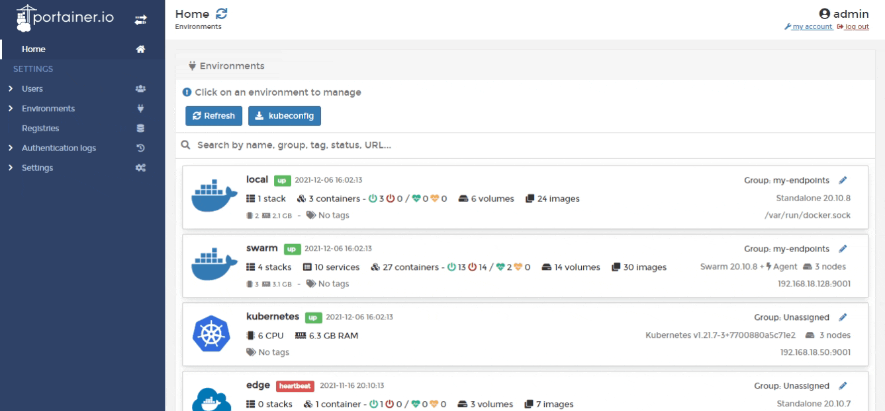

# Add a new registry

From the menu select **Registries** then click **Add registry**.

From the **Registry provider** section select the type of registry you want to add.


Simply adding a registry will not make that registry available to non-administrator users. Once you have added the registry to Portainer, you will need to add access to the registry within [Host](../../../user/docker/host/registries.md) / [Swarm](../../../user/docker/swarm/registries.md) / [Cluster](../../../user/kubernetes/cluster/registries.md) for each environment that needs access.


Portainer provides configuration support for a number of popular registry providers:


[dockerhub.md](dockerhub.md)



[aws-ecr.md](aws-ecr.md)



[quay.md](quay.md)



[proget.md](proget.md)



[azure.md](azure.md)



[gitlab.md](gitlab.md)


You can also add your own custom registry:


[custom.md](custom.md)

