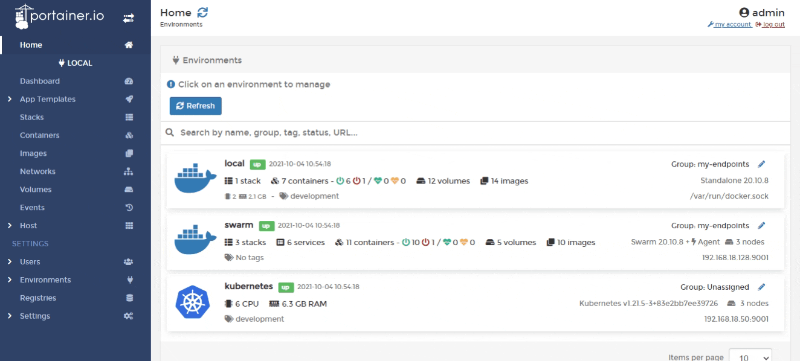

# Add a new registry

From the menu select **Registries** then click **Add registry**.

From the **Registry provider** section select the type of registry you want to add. Portainer provides configuration support for a number of popular registry providers:









You can also add your own custom registry:



