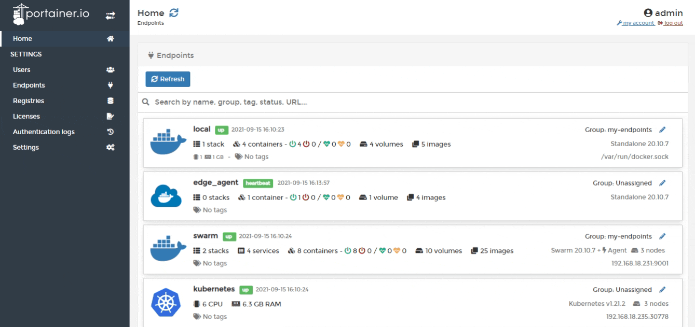
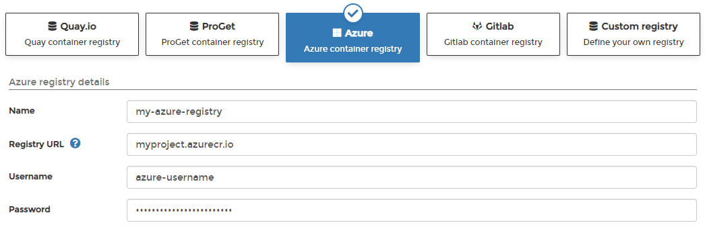

# Add an Azure registry

From the menu select **Registries** then click **Add registry** and select **Azure** as the registry provider.

Complete the form, using the table below as a guide.

| Field/Option | Overview |
| :--- | :--- |
| Name | Enter the name you'd like to use in Portainer for your registry. |
| Registry URL | Enter the URL of your Azure registry. |
| Username | Enter the username you use to log into your Azure registry. |
| Password | Enter the password that corresponds to the username above. |

When the form is complete, click **Add registry**.

