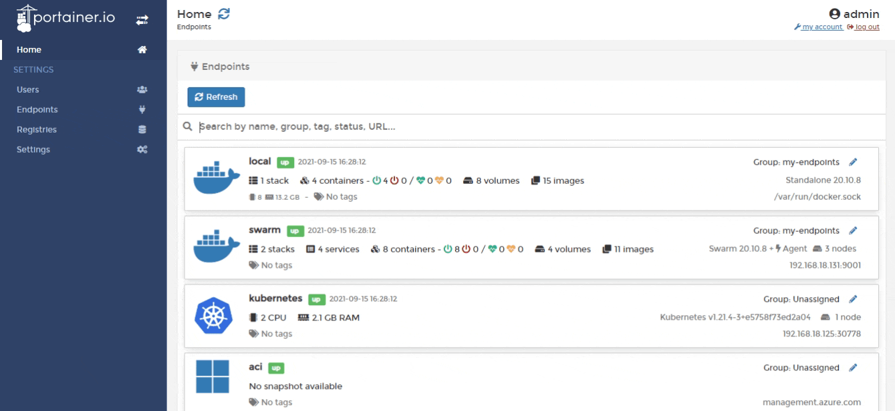
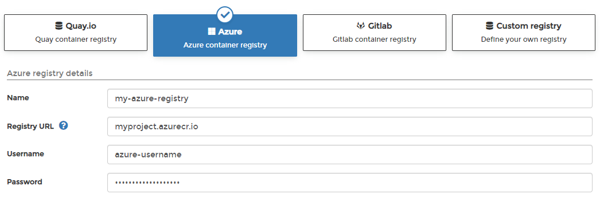

# Add an Azure registry

From the menu select **Registries** then click **Add registry** and select **Azure** as the registry provider.

Complete the form, using the table below as a guide.

| Field/Option | Overview                                                         |
| ------------ | ---------------------------------------------------------------- |
| Name         | Enter the name you'd like to use in Portainer for your registry. |
| Registry URL | Enter the URL of your Azure registry.                            |
| Username     | Enter the username you use to log into your Azure registry.      |
| Password     | Enter the password that corresponds to the username above.       |

When the form is complete, click **Add registry**.


Simply adding a registry will not make that registry available to non-administrator users. Once you have added the registry to Portainer, you will need to add access to the registry within [Host](../../../user/docker/host/registries.md) / [Swarm](../../../user/docker/swarm/registries.md) / [Cluster](../../../user/kubernetes/cluster/registries.md) for each environment that needs access.

