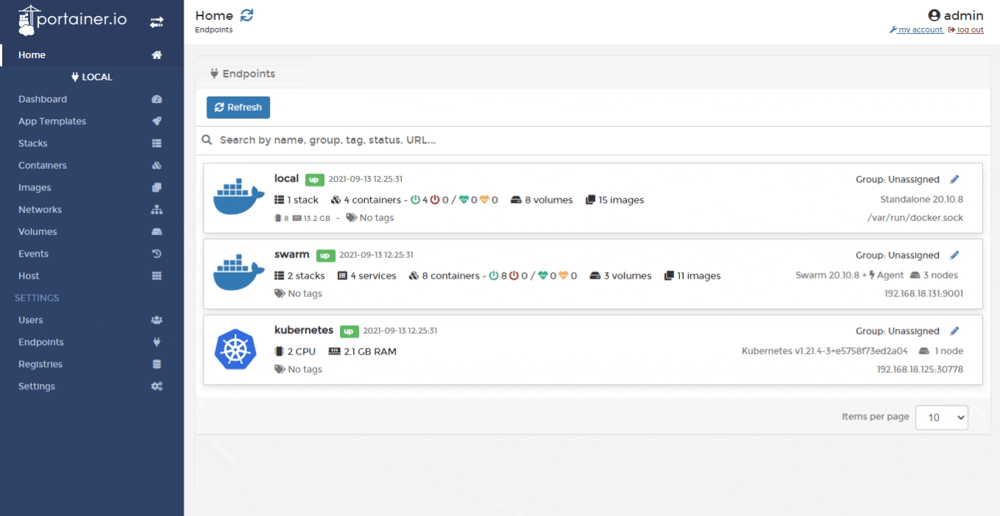

# Add a custom registry

From the menu select **Registries** then click **Add registry**. Ensure **Custom registry** is selected.

In the **Custom registry details** section, enter the registry name and URL (both mandatory). If authentication is required, toggle **Authentication** on and enter the username and password.&#x20;

When you're finished, click **Add registry**.


Simply adding a registry will not make that registry available to non-administrator users. Once you have added the registry to Portainer, you will need to add access to the registry within [Host](../../../user/docker/host/registries.md) / [Swarm](../../../user/docker/swarm/registries.md) / [Cluster](../../../user/kubernetes/cluster/registries.md) for each environment that needs access.


