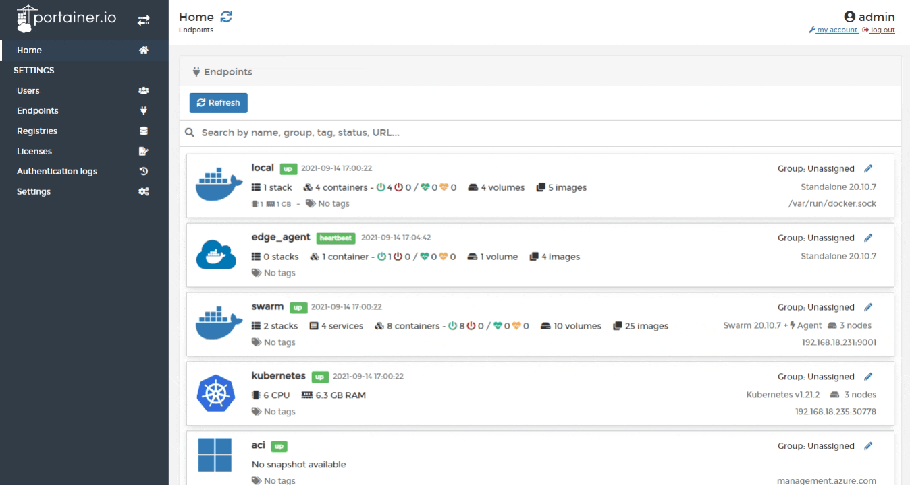
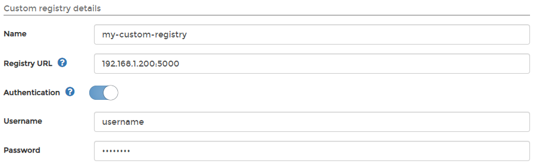

# Add a custom registry

From the menu select **Registries** then click **Add registry**. Ensure **Custom registry** is selected.

In the **Custom registry details** section, enter the registry name and URL \(both mandatory\). If authentication is required, toggle **Authentication** on and enter the username and password. 

When you're finished, click **Add registry**.

