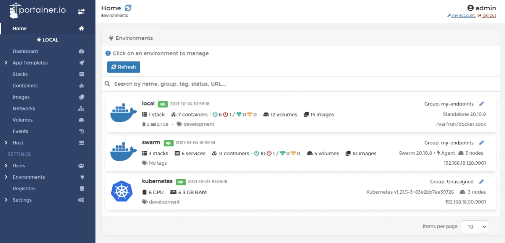
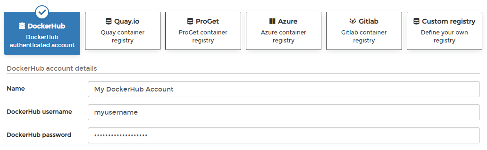

# Add a DockerHub account

Portainer provides built-in support for anonymous DockerHub access, but in some cases you may need to log into DockerHub (for example, private images or to support pulling a large number of images).

From the menu select **Registries** then click **Add registry** and select **DockerHub** as the registry provider.

Complete the form, using the table below as a guide.

| Field/Option       | Overview                                                                                                                        |
| ------------------ | ------------------------------------------------------------------------------------------------------------------------------- |
| Name               | Enter a name for the registry. This is how it will appear in the list of registries and when selecting a registry to pull from. |
| DockerHub username | Enter the username you use to connect to DockerHub.                                                                             |
| DockerHub password | Enter the password that corresponds to the username above.                                                                      |

When the form is complete, click **Add registry**.

