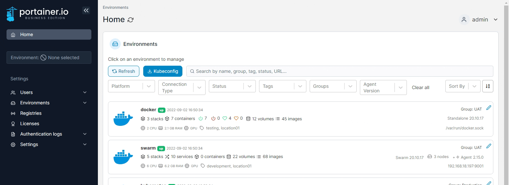

# Add a DockerHub account

Portainer provides built-in support for anonymous Docker Hub access, but in some cases you may need to log into Docker Hub (for example, private images or to support pulling a large number of images).

From the menu select **Registries** then click **Add registry** and select **DockerHub** as the registry provider.

<figure><figcaption></figcaption></figure>

Complete the form, using the table below as a guide.

| Field/Option           | Overview                                                                                                                                                                                                                                 |
| ---------------------- | ---------------------------------------------------------------------------------------------------------------------------------------------------------------------------------------------------------------------------------------- |
| Name                   | Enter a name for the registry. This is how it will appear in the list of registries and when selecting a registry to pull from.                                                                                                          |
| DockerHub username     | Enter the username you use to connect to Docker Hub.                                                                                                                                                                                     |
| DockerHub access token | Enter a Docker Hub personal access token that corresponds to the username above. You can create an access token by logging into Docker Hub, clicking your username in the top right and going to Account Settings then the Security tab. |

<figure><figcaption></figcaption></figure>

When the form is complete, click **Add registry**.

