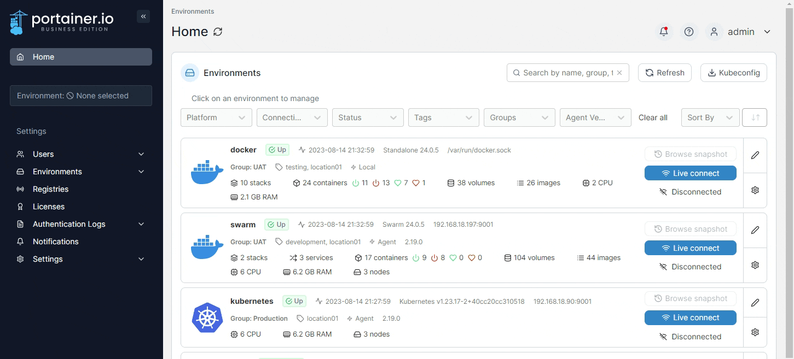
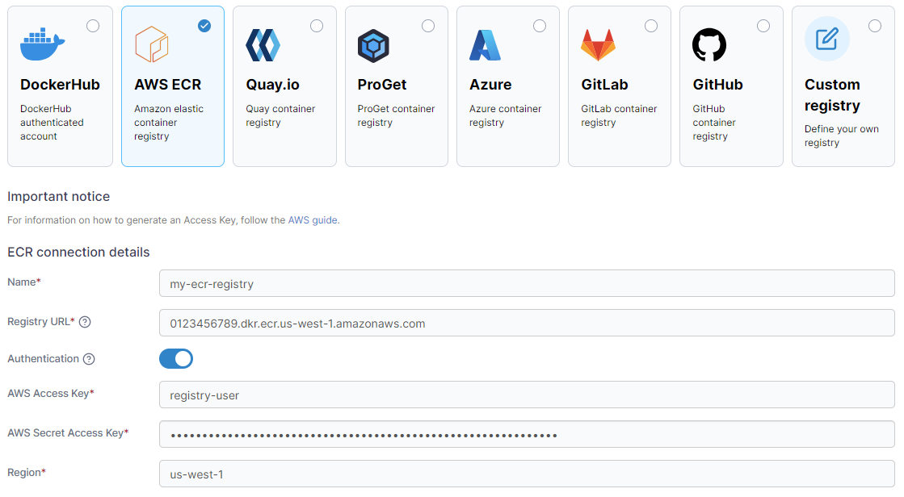

# Add an AWS ECR registry

From the menu select **Registries** then click **Add registry** and select **AWS ECR** as the registry provider.

<figure><figcaption></figcaption></figure>

## Preparation

If your registry requires authentication to access, you must create an IAM user with access to the registry for Portainer to use. Instructions on creating an IAM user are available [from AWS](https://docs.aws.amazon.com/IAM/latest/UserGuide/id\_users\_create.html#id\_users\_create\_console). When you have created the user, make note of the **Access key ID** and **Secret access key**, as you will need these below.


At present we do not support IAM users with MFA enabled. We recommend creating a user specifically for Portainer to use with MFA disabled.


When creating the user you will need to attach one or more policies to provide registry access. For full registry management functionality within Portainer, we recommend the `AmazonEC2ContainerRegistryFullAccess` policy.

## Add your registry

Complete the form, using the table below as a guide.

| Field/Option          | Overview                                                                                                                                                            |
| --------------------- | ------------------------------------------------------------------------------------------------------------------------------------------------------------------- |
| Name                  | Enter the name you'd like to use in Portainer for your registry.                                                                                                    |
| Registry URL          | Enter the URL of your AWS ECR registry, including the account ID and region. You can find this in the AWS console under Amazon Container Services, ECR, Registries. |
| Authentication        | Enable this option if your registry requires authentication to access.                                                                                              |
| AWS Access Key        | Enter the Access key ID for the IAM user that will access the AWS ECR registry.                                                                                     |
| AWS Secret Access Key | Enter the Secret access key for the above IAM user.                                                                                                                 |
| Region                | Enter the region your registry is in, for example `us-west-1`.                                                                                                      |

<figure><figcaption></figcaption></figure>

When the form is complete, click **Add registry**.
