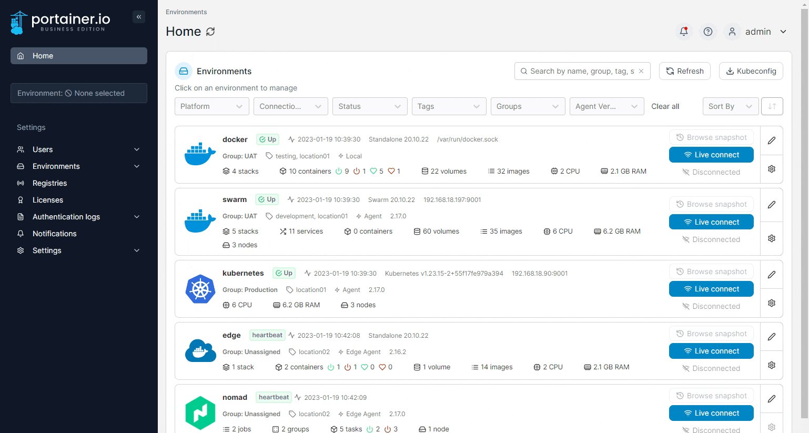
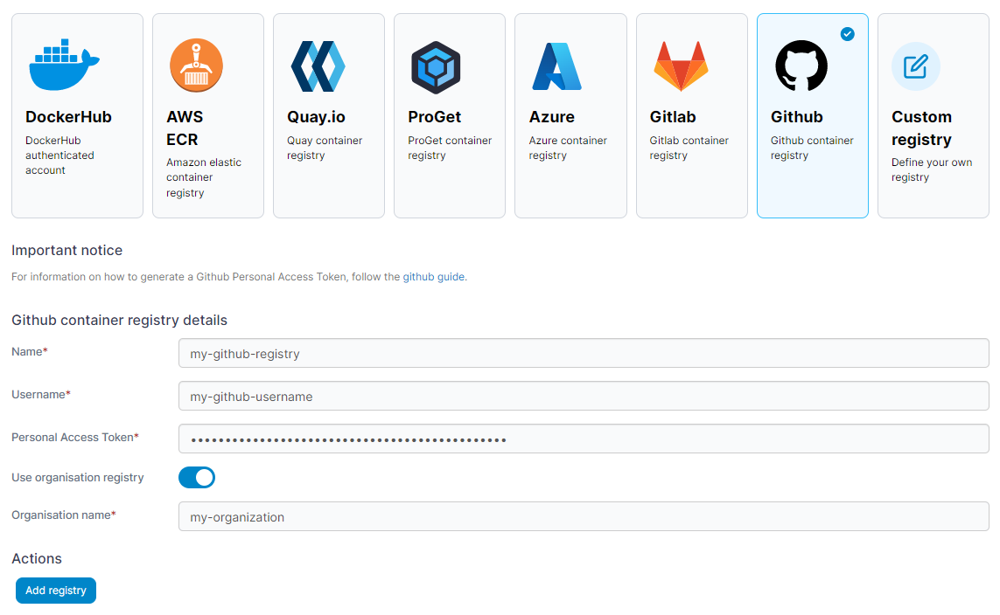

# Add a GitHub registry


The GitHub registry option is only available in Portainer Business Edition.


From the menu select **Registries** then click **Add registry** and select **GitHub** as the registry provider.

<figure><figcaption></figcaption></figure>

Complete the form, using the table below as a guide.

| Field/Option              | Overview                                                                                                                                                                                                                                                                                                                                                                                                                                                                                                      |
| ------------------------- | ------------------------------------------------------------------------------------------------------------------------------------------------------------------------------------------------------------------------------------------------------------------------------------------------------------------------------------------------------------------------------------------------------------------------------------------------------------------------------------------------------------- |
| Name                      | Enter the name you'd like to use in Portainer for your registry.                                                                                                                                                                                                                                                                                                                                                                                                                                              |
| Username                  | Enter the username you use to log into your GitHub registry.                                                                                                                                                                                                                                                                                                                                                                                                                                                  |
| Personal Access Token     | 
Enter the personal access token (classic) that corresponds to the username above. Your personal access token (classic) will need the <code>delete:packages</code>, <code>repo</code>, and <code>write:packages</code> scopes assigned. GitHub <a href="https://docs.github.com/en/packages/working-with-a-github-packages-registry/working-with-the-container-registry#authenticating-to-the-container-registry">does not currently support</a> the use of fine-grained tokens for registry access.
 |
| Use organisation registry | Toggle this on if your registry is part of a Github organization.                                                                                                                                                                                                                                                                                                                                                                                                                                             |
| Organisation name         | Enter the name of your GitHub organization.                                                                                                                                                                                                                                                                                                                                                                                                                                                                   |

<figure><figcaption></figcaption></figure>


For more information about creating a personal access token, see [GitHub's own documentation](https://docs.github.com/en/authentication/keeping-your-account-and-data-secure/creating-a-personal-access-token).


When the form is complete, click **Add registry**.
