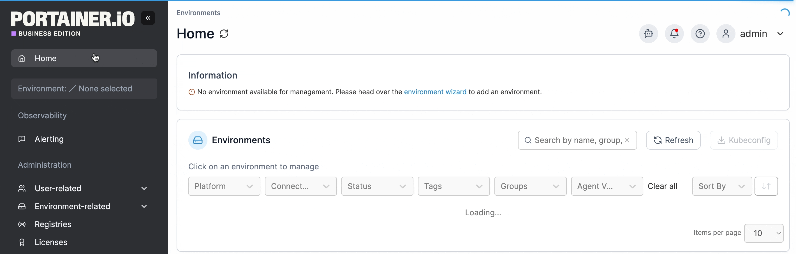
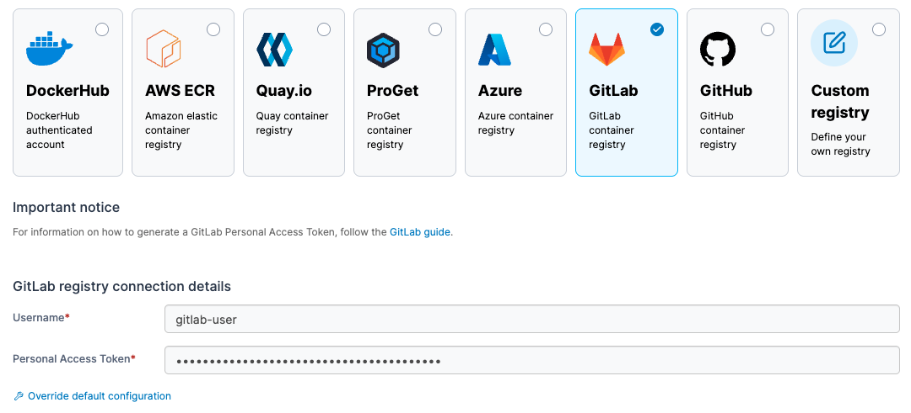

---
metaLinks:
  alternates:
    - https://app.gitbook.com/s/j6QEqM3Sd94bdPsX4HaN/admin/registries/add/gitlab
---

# Add a GitLab registry

From the menu select **Registries** then click **Add registry** and select **GitLab** as the registry provider.

<figure><figcaption></figcaption></figure>

Complete the form, using the table below as a guide.

| Field/Option                   | Overview                                                                                                                                                         |
| ------------------------------ | ---------------------------------------------------------------------------------------------------------------------------------------------------------------- |
| Username                       | Enter the username you use to log into your GitLab registry.                                                                                                     |
| Personal Access Token          | Enter the personal access token that corresponds to the username above. Your personal access token will need the `read_api` and `read_registry` scopes assigned. |
| Override default configuration | If you need to make changes to the Portainer defaults for GitLab, you can do so here.                                                                            |

<figure><figcaption></figcaption></figure>


For more information about creating a personal access token, see [Gitlab's own documentation](https://docs.gitlab.com/ee/user/profile/personal_access_tokens.html).


When the form is complete, click **Add registry**.
