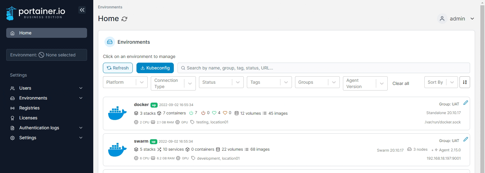
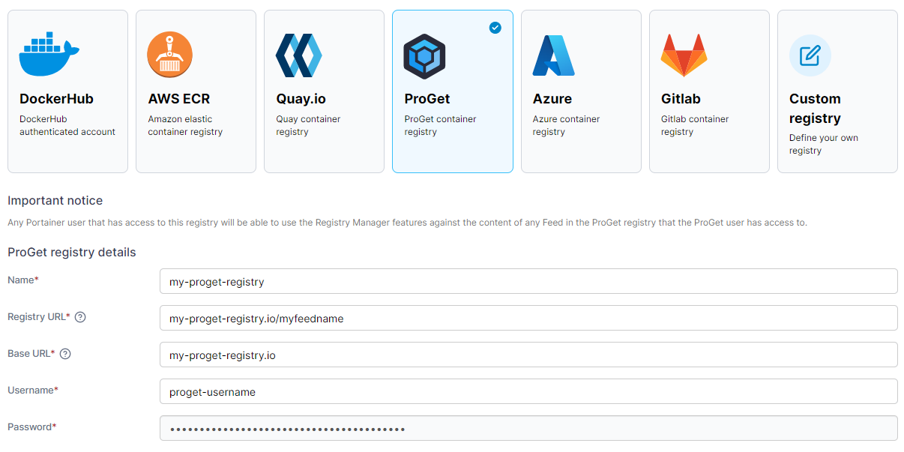

# Add a ProGet registry

From the menu select **Registries** then click **Add registry** and select **ProGet** as the registry provider.

<figure><figcaption></figcaption></figure>

Complete the form, using the table below as a guide.

| Field/Option | Overview                                                         |
| ------------ | ---------------------------------------------------------------- |
| Name         | Enter the name you'd like to use in Portainer for your registry. |
| Registry URL | Enter the URL of your ProGet registry, including the feed name.  |
| Base URL     | Enter the base URL of your ProGet registry.                      |
| Username     | Enter the username you use to log into your ProGet registry.     |
| Password     | Enter the password that corresponds to the username above.       |

<figure><figcaption></figcaption></figure>

When the form is complete, click **Add registry**.
