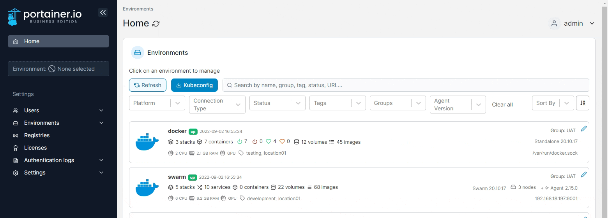
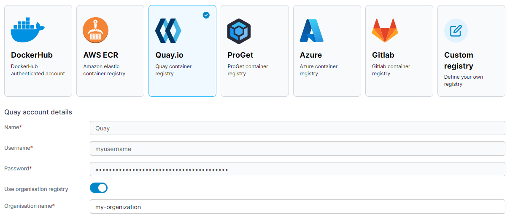

# Add a Quay.io registry

From the menu select **Registries** then click **Add registry** and select **Quay.io** as the registry provider.

<figure><figcaption></figcaption></figure>

Complete the form, using the table below as a guide.

| Field/Option              | Overview                                                                                           |
| ------------------------- | -------------------------------------------------------------------------------------------------- |
| Username                  | Enter the username you use to connect to your Quay.io registry.                                    |
| Password                  | Enter the password that corresponds to the username above.                                         |
| Use organisation registry | Toggle on if you need to specify the organization to use when connecting to your Quay.io registry. |

<figure><figcaption></figcaption></figure>

When the form is complete, click **Add registry**.
