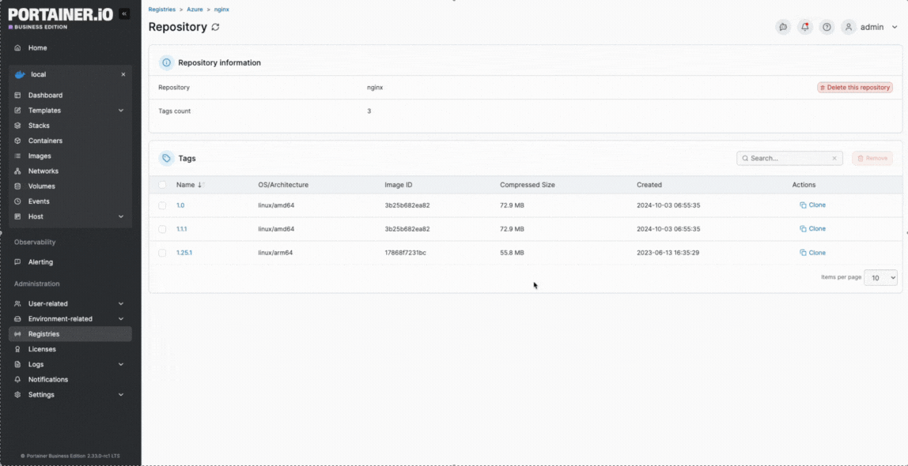

# Manage a registry

The registry manager extends your container management experience by giving you the ability to browse defined registries and manipulate their content. By using this feature, container users enjoy the benefit of having a single interface to manage any Docker registry deployment, providing a consistent look and feel across any provider.

## Adding a tag

From the menu select **Registries**, select the registry you want to manage then click **browse**. From the list, select the repository you want to manage.

To add a new tag, you must clone an existing tag. Locate the tag you want to use as a template, click the **Clone** action, enter the new name and click **Clone Tag**.

<figure><figcaption></figcaption></figure>

## Retagging


If you host your own Docker registry, and you want the ability to retag images, you will need to add the following to your Docker registry's environment variables:

`REGISTRY_STORAGE_DELETE_ENABLED=TRUE`


From the menu select **Registries**, choose the registry you want to manage and click **browse**. From the list of repositories, select the repository you want to manage.

To retag, you must clone and then delete an existing tag. Locate the tag you want to retag, click the **Clone** action, enter the new name and click **Clone Tag**. Then, remove the original tag by ticking the checkbox next to the tag and click **Remove**.

<figure><figcaption></figcaption></figure>

## Removing a tag


If you host your own Docker registry, and want the ability to remove tags, you will need to add the following to your Docker registry's environment variables:

`REGISTRY_STORAGE_DELETE_ENABLED=TRUE`


From the menu select **Registries**, select the registry you want to manage then click **Browse**. From the list, select the repository you want to manage.

Tick the checkbox next to the tag you want to remove then click **Remove**. When the confirmation message appears, if you're sure, click **Delete**.

<figure><figcaption></figcaption></figure>
