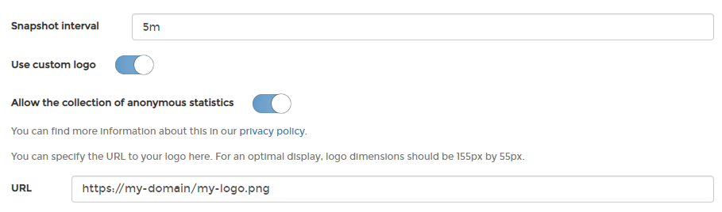
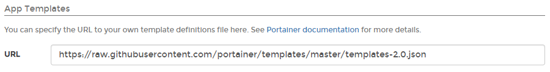
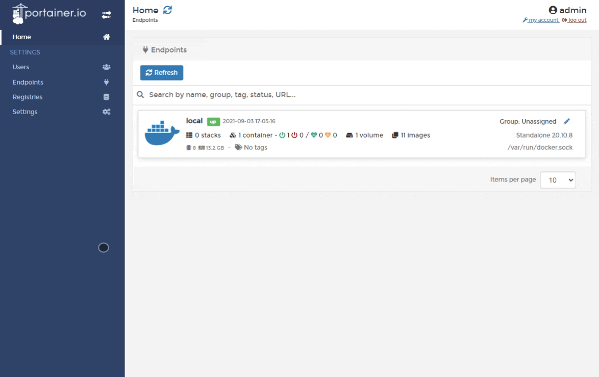
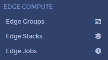
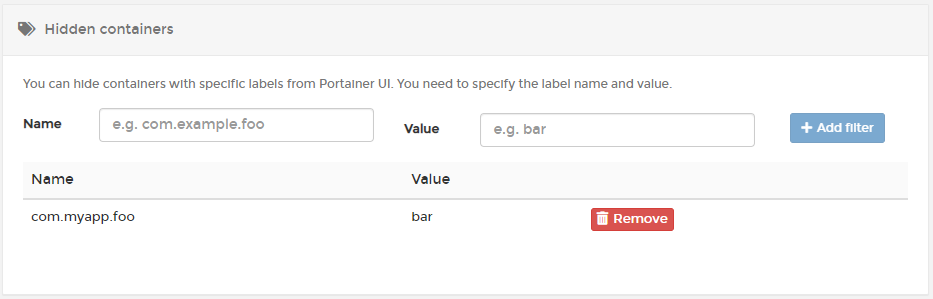
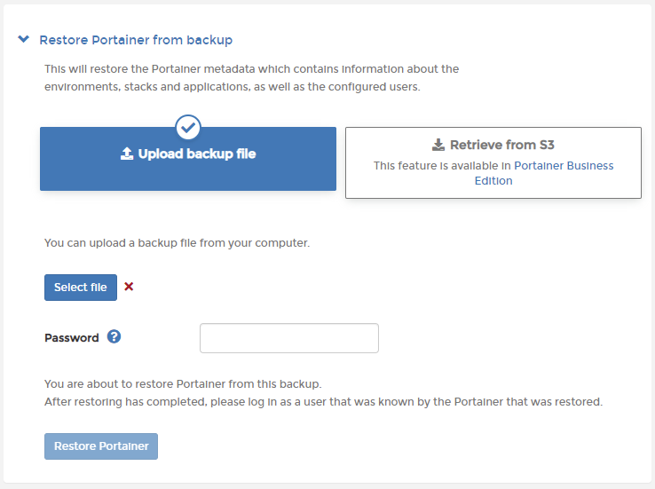

# Settings

## Application settings

### Snapshot interval

Defines how often a data snapshot of endpoints is taken. Can be overridden for individual endpoints in the endpoint configuration.

### Use custom logo

Replaces our logo with your own. Toggle on and enter the URL to the logo. The recommended size is 155px by 55px.

### Allow the collection of anonymous statistics

We collect anonymized information about your Portainer installation to help with our product development. You can opt out during installation, or toggle this setting off at any time. 

### App Templates

You can deploy containers and services using Portainer's set of built-in app templates, or [replace them with your own](../../advanced/app-templates/build.md) set of templates. Once you have a JSON file containing the template definitions, you can provide the URL to it here.

### Edge Compute

To enable [Edge Compute](../../user/edge/) functionality in Portainer, select **Settings** from the menu then scroll down to the **Edge Compute** section. Toggle **Enable edge compute features** on then click **Save settings**. You can also adjust the **Edge agent default poll frequency** of individual endpoints to a value that suits.

Once Edge Compute is enabled, more options will be available in the menu:

## Hidden containers

Stops a container from appearing in the Portainer UI through the container label. Enter the name and value of the label, then click **Add filter**. Containers with matching labels will be hidden.

## Backup Portainer

This setting contains all of the information that Portainer stores on the `/data` volume, archived in a `tar.gz` file, and is optionally encrypted with a password. This archive is all you need to restore Portainer.

### Backing up to a local disk 

Log in as an admin user. From the menu select **Settings**, then scroll down to the **Backup Portainer** section.

**Download backup file** is the default option. As an optional step, toggle **Password protect** on and enter a password to encrypt the backup file. When you click **Download backup**, a `tar.gz` file will be downloaded via the browser.


The **Store in S3** option is only available in Portainer Business Edition.


### Restoring from a local file

Restoring a configuration is only possible on a fresh instance of Portainer during the initial installation. When you need to restore Portainer, deploy a fresh instance of Portainer with an empty data volume and choose the **Restore Portainer from backup** option during setup.

On the initialization page, expand **Restore Portainer from backup**. Click **Select file** then browse to and select the `tar.gz` backup file. If the backup was originally encrypted, enter the password then click **Restore Portainer**.

The restore might take a few moments. When it has finished, you will be redirected to the login page. You can now log in with your previous credentials and your previous configuration will be restored.

