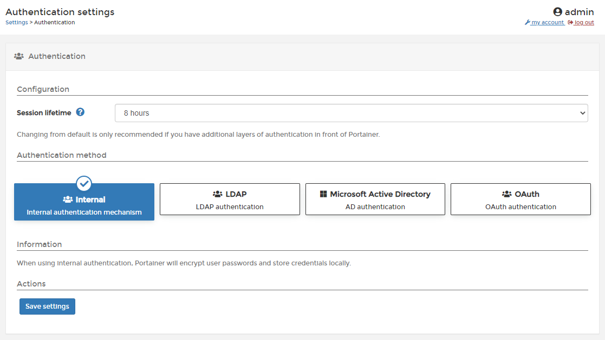

# Authentication

Portainer provides its own internal authentication mechanism, encrypting user passwords and storing them in the local Portainer database. Alternatively, external authentication providers are available. In this section, we explain how to authenticate via LDAP, Active Directory and OAuth.


For all authentication types you can adjust the session lifetime (the time before users are forced to reauthenticate). The default is 8 hours.



[ldap.md](ldap.md)



[active-directory.md](active-directory.md)



[oauth.md](oauth.md)


