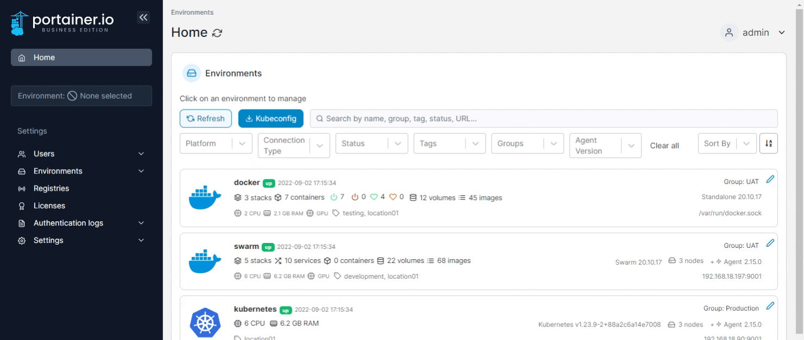
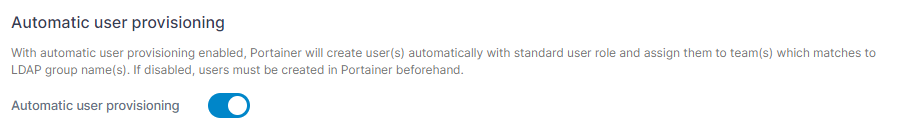
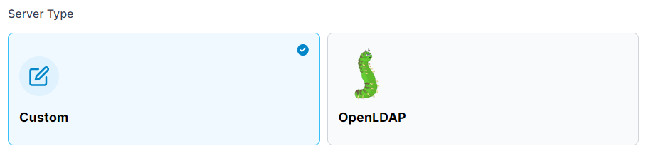
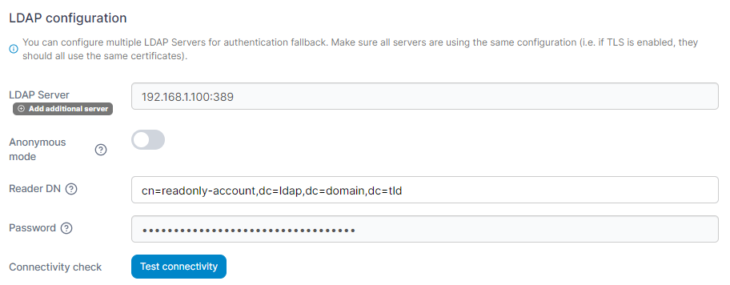
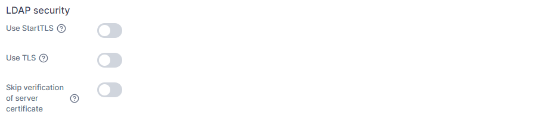
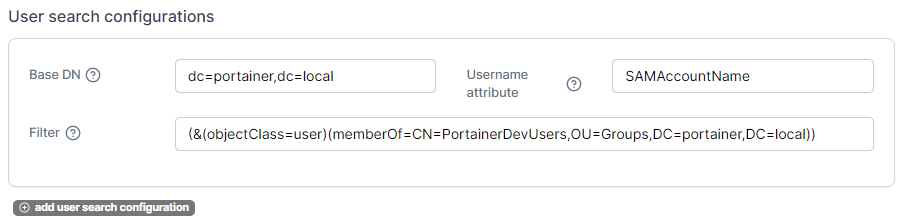
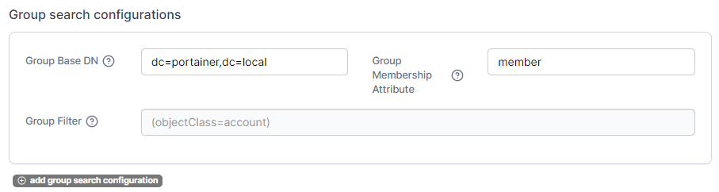
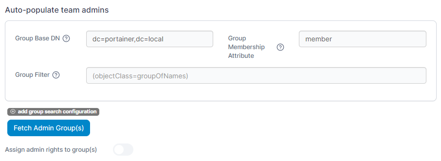

# Authenticate via LDAP

## Introduction

Portainer can be configured to accept Lightweight Directory Access Protocol (LDAP) authentication if your organization has implemented LDAP authentication. When users attempt to log into Portainer, the application will authenticate them against your LDAP directory. If authentication is successful, the user is allowed to log into Portainer.

To configure Portainer LDAP authentication, you first need to add a user to your directory service for the purpose of authenticating from Portainer to read the LDAP. The user should be a service account that needs read-only access to LDAP.

## Enabling LDAP

Log into Portainer as an administrator. From the menu select **Settings**, select **Authentication** then select the **LDAP Authentication** option. Extra fields will appear, allowing you to configure LDAP.

<figure><figcaption></figcaption></figure>

### Automatic user provisioning

Enabling this setting automatically creates users within Portainer once they are successfully authenticated by LDAP. If you do not enable this, you must [manually create users](ldap.md#manually-creating-ldap-users) with the same username as the corresponding LDAP directory.

<figure><figcaption></figcaption></figure>

### Server Type

Here you can select a custom configuration or a preconfigured OpenLDAP template.

<figure><figcaption></figcaption></figure>

### LDAP configuration

Enter the IP address/FQDN and port number of your LDAP server. Opt to either connect anonymously (your LDAP server must support this) or enter a user account that has READ access to the directory. Click **Test connectivity** to validate that you can connect.


For OpenLDAP, the Reader DN format should be set to `cn=user,dc=domain,dc=tld`. If your configuration differs you will need to adjust this to suit.


<figure><figcaption></figcaption></figure>

If you want to add additional LDAP servers to provide for authentication fallback, click **Add additional server** and fill in the server details.

### LDAP security

Configure the remaining LDAP settings, using the table below as a guide:

| Field/Option                            | Overview                                                                                                                                                                                                                                                                                                                                   |
| --------------------------------------- | ------------------------------------------------------------------------------------------------------------------------------------------------------------------------------------------------------------------------------------------------------------------------------------------------------------------------------------------ |
| Use StartTLS                            | Changes the insecure connection to secure after the initial connection.                                                                                                                                                                                                                                                                    |
| Use TLS                                 | Initiates a connection to LDAP using TLS.                                                                                                                                                                                                                                                                                                  |
| Skip verification of server certificate | If you do not have access to the LDAP server certificate, skipping verification will enable encrypted communications. However, you must manually ensure that you are talking to the intended LDAP server that you specified in the URL. If that gets maliciously redirected, you could be talking to a different server. Use with caution. |

<figure><figcaption></figcaption></figure>

| Field/Option       | Overview                                                       |
| ------------------ | -------------------------------------------------------------- |
| TLS CA certificate | Lets you upload your CA certificate for the secure connection. |

<figure><figcaption></figcaption></figure>

### User-search configurations

#### BaseDN

* Enter `dc=mydomain,dc=com` to search your entire directory for the username attempting to login.
* Enter `ou=myou,dc=mydomain,dc=com` to search for users only within the specified OU.
* Enter `cn=mycn,dc=mydomain,dc=com` if your users are only in a container.

If you have a large number of users in your domain, narrow the scope Portainer searches on by using OUs.

#### Username attribute

For LDAP, enter `uid` unless your configuration differs.

#### Filter


These entries are case sensitive.


Enter filter criteria for the results returned from LDAP to Portainer. For example, to only allow users who are members of a group defined within an OU to login, set **Filter** to the following (the brackets are important, so copy the entire string):

```
(&(objectClass=user)(memberOf=cn=mycn,ou=myou,dc=mydomain,dc=com))
```

In the example below, the domain `portainer.local` has an OU called `Groups` and within that OU is a group called `PortainerDevUsers`. This search filter will only allow users who are members of the `PortainerDevUsers` LDAP group to log into Portainer.

<figure><figcaption></figcaption></figure>

As an optional step, click **Add user search configuration** to define additional user-search configurations.

### Group-search configurations

In addition to user search, Portainer also gives you the option to set up group search. When configured, if an LDAP user is a member of an LDAP group, and that LDAP Group corresponds to an identically named Portainer [Team](../../user/teams/), then the LDAP user will automatically be placed into the Portainer Team based on their LDAP group membership. This is very useful for automatically granting access to Portainer environments via group membership.

#### Group Base DN

Enter either:

* Enter `dc=mydomain,dc=com` to search your entire directory for the list of groups.
* Enter `ou=myou,dc=mydomain,dc=com` to search for groups only within the specified OU.
* Enter `cn=mycn,dc=mydomain,dc=com` if your groups are only in a container.

If you have a large number of groups in your domain, narrow the scope Portainer searches on by using OUs.

<figure><figcaption></figcaption></figure>

#### Group Membership Attribute

Enter `member` as the attribute that determines if a user is a member of a group.

#### Group Filter

If you want to filter the list of groups to return only those that contain the string `Portainer` (for example: `PortainerDev`, `PortainerProd`, `PortainerUAT`), set up the filter like this:

```
(&(objectclass=group)(cn=*Portainer*))
```

<figure><figcaption></figcaption></figure>

As an optional step, click **Add group search configuration** to define additional group-search configurations.

### Auto-populate team admins

If desired, Portainer can configure specified LDAP groups of users to become Portainer administrators automatically.&#x20;

To configure this, first click **add group search configuration** and define the **Group Base DN**, **Groups** and **Group Filter** as required. Once done, click the **Fetch Admin Group(s)** button to retrieve the list of groups matching your search configuration.

<figure><figcaption></figcaption></figure>

When you're happy with the group selection, enable this feature by toggling **Assign admin rights to group(s)** on.

### Test login

To test your configuration, you can enter a username and password and click the **Test** button.

<figure><figcaption></figcaption></figure>

## Manually creating LDAP users


This is an optional step and is required only if you do not use automatic user provisioning.


Once LDAP has been enabled, from the menu select **Users**. Create a username that matches your LDAP source users with the format defined when you enabled LDAP (either `username` or `username@mydomain.com`).
