# Authenticate via OAuth

## Configuring OAuth authentication in Portainer

From the menu select **Settings** then select **Authentication**. Under the **Authentication method** section click **OAuth**.

<figure>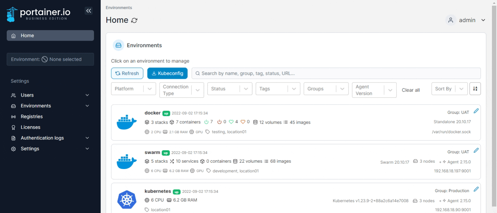<figcaption></figcaption></figure>

In the next screen, enter the credentials provided by your OAuth provider, using the table below as a guide.

| Field/Option                        | Overview                                                                                                                                                                                                                                                                      |
| ----------------------------------- | ----------------------------------------------------------------------------------------------------------------------------------------------------------------------------------------------------------------------------------------------------------------------------- |
| Use SSO                             | Enable SSO so that the OAuth provider won't be forced to ask for credentials when users are in a current logged-in session.                                                                                                                                                   |
| Hide internal authentication prompt | Hide the ability to log in through internal authentication.                                                                                                                                                                                                                   |
| Automatic user provisioning         | If toggled on, users who exist at the OAuth provider's end will automatically be created in Portainer (you can define a default team to put those users in while this option is on). If toggled off, you'll need to [create users](../../users/add.md) in Portainer manually. |

<figure>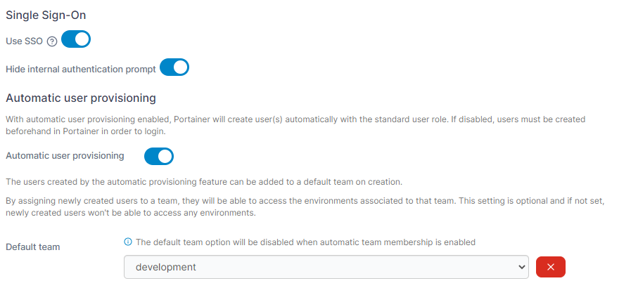<figcaption></figcaption></figure>

If you toggle **Automatic team membership** on, you can choose to automatically add OAuth users to certain Portainer teams based on the **Claim name**. Claim names will be matched with teams or you can manually link a claim name (using regex) with Portainer teams under the **Statically assigned teams** option. You can also define a **Default team** for users who don't belong to any other team.

In addition, you can enable the automatic assignment of admin rights to specified groups if desired.

<figure>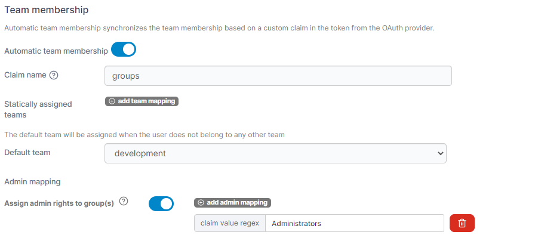<figcaption></figcaption></figure>


When configuring Microsoft Entra ID (Azure AD) as the OAuth provider, you will need to use the [group's Object Id value](https://learn.microsoft.com/en-us/entra/fundamentals/how-to-manage-groups#edit-group-settings) for the claim value regex instead of the group name.


<figure>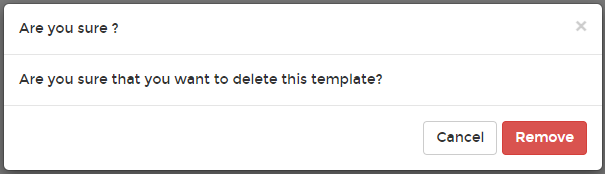<figcaption></figcaption></figure>

##

## OAuth providers

Portainer provides pre-configured OAuth provider options or you can set up your own custom OAuth provider. Each of the pre-configured providers can have their configuration overridden if you need to make changes to the Portainer defaults.

### Microsoft

Configure your OAuth provider using the table below as a guide.

| Field/Option    | Overview                                                                                                          |
| --------------- | ----------------------------------------------------------------------------------------------------------------- |
| Tenant ID       | Enter the ID of the Azure Directory you wish to authenticate against. This is also known as the **Directory ID**. |
| Application ID  | Enter the public identifier of the OAuth application.                                                             |
| Application key | Enter the secret key for the OAuth application.                                                                   |

You can find these details using the following steps:

1.  Log in to your Azure Portal as an administrator.

    <figure>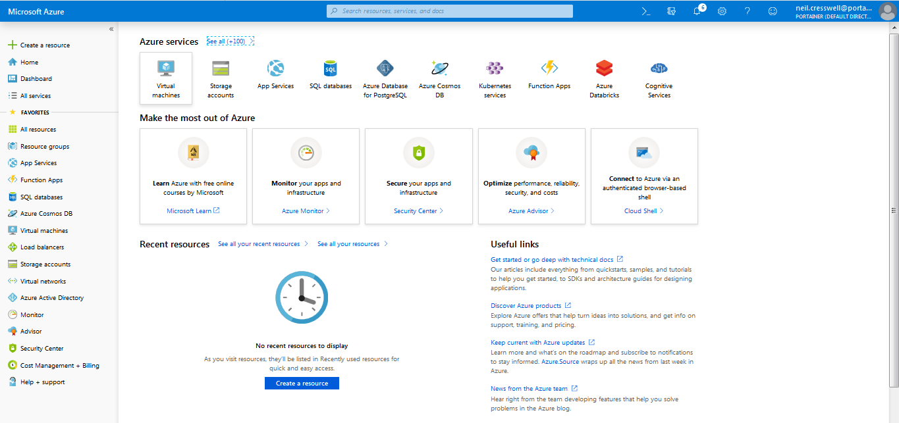<figcaption></figcaption></figure>
2.  Click on **Azure Active Directory** and then click on **Overview**. Your **Tenant ID** can be found in the right pane. Use this as the **Tenant ID** in Portainer.

    <figure>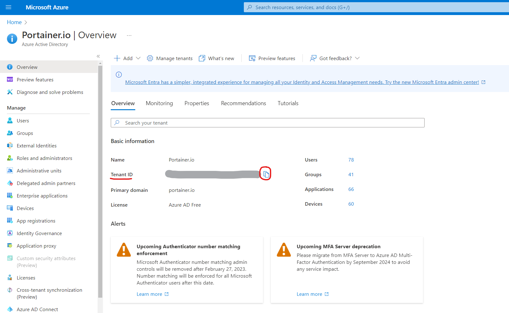<figcaption></figcaption></figure>
3.  Still in Azure Active Directory, click on **App Registrations** then click **New registration**.

    Enter a friendly name for the Portainer instance. Choose appropriate option for Supported account types, Choose `Web` type for **Redirect URI** and enter the FQDN or IP address that your Portainer instance listens on `eg: https://portainer.example.com:9443`. Then click **Register**.

    <figure>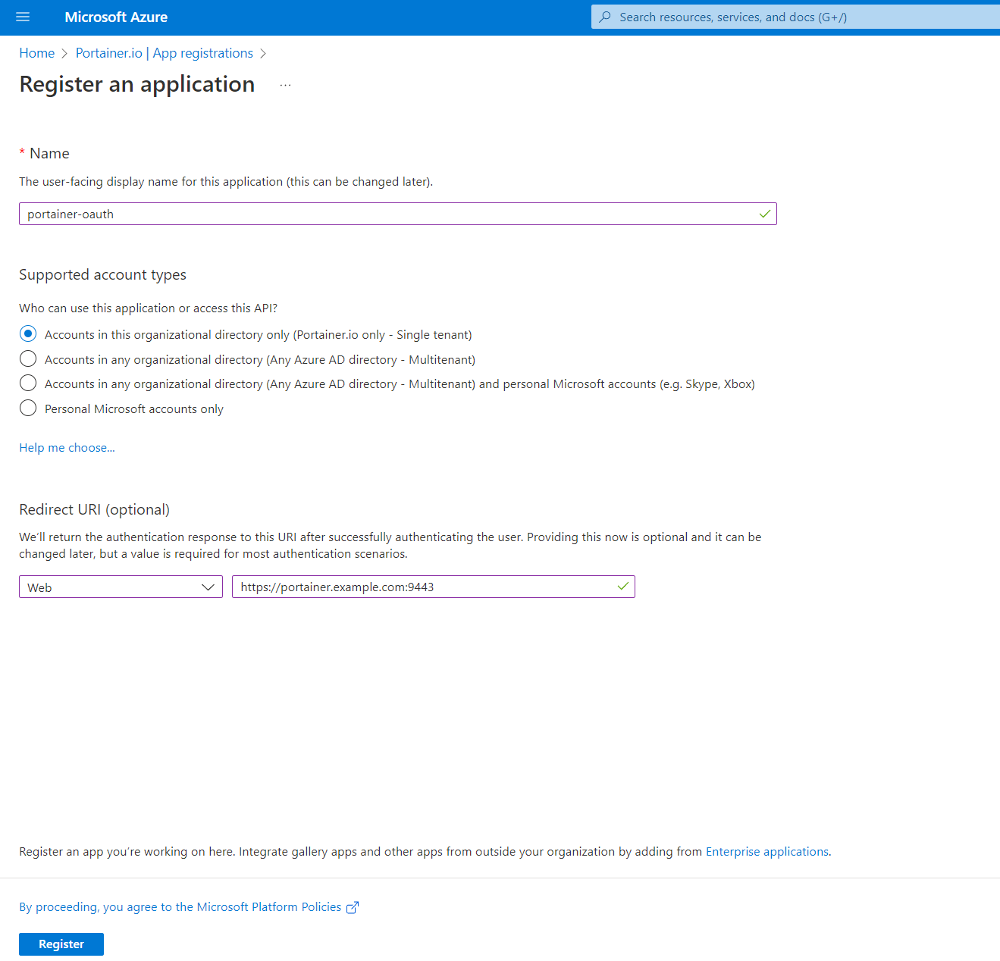<figcaption></figcaption></figure>

    <figure>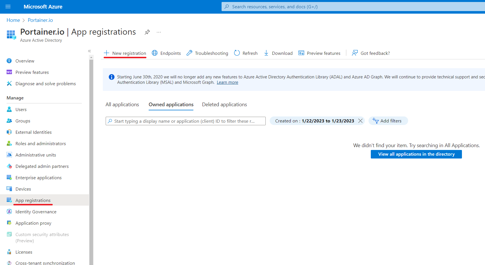<figcaption></figcaption></figure>
4.  After creating the Registration, the screen below is displayed. Use the provided **Application ID** in the respective field in Portainer.

    <figure>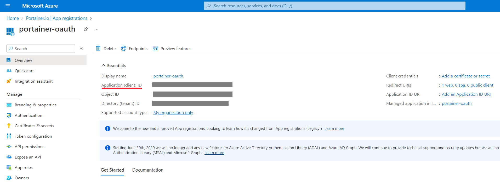<figcaption></figcaption></figure>
5.  Click on **Certificates & secrets** then click **Client secrets**, Click on **New client secret**. Add **Description** and choose Expiry date, then Click **Add.**

    The secret will then be generated for you. Use the Value as the **Application key** in the respective field in Portainer.

    <figure>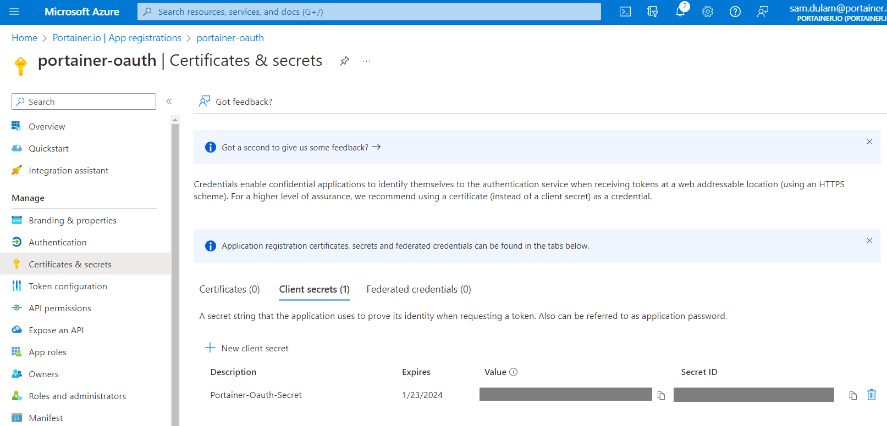<figcaption></figcaption></figure>

    <figure>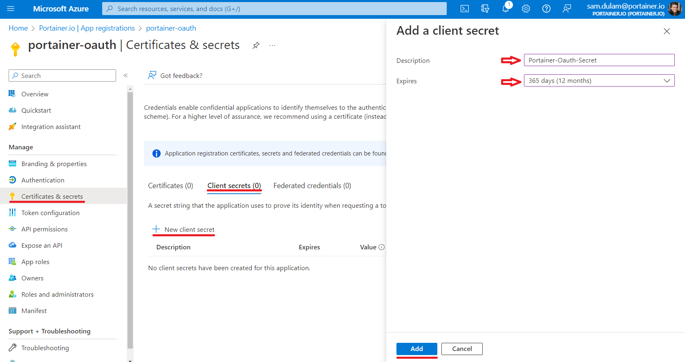<figcaption></figcaption></figure>
6.  Click on **API Permissions** and **Add a permission**. Select **Microsoft Graph** in the **Request API permissions screen**. Select **Delegated permissions** and add `email, openid, profile` permissions.

    <figure>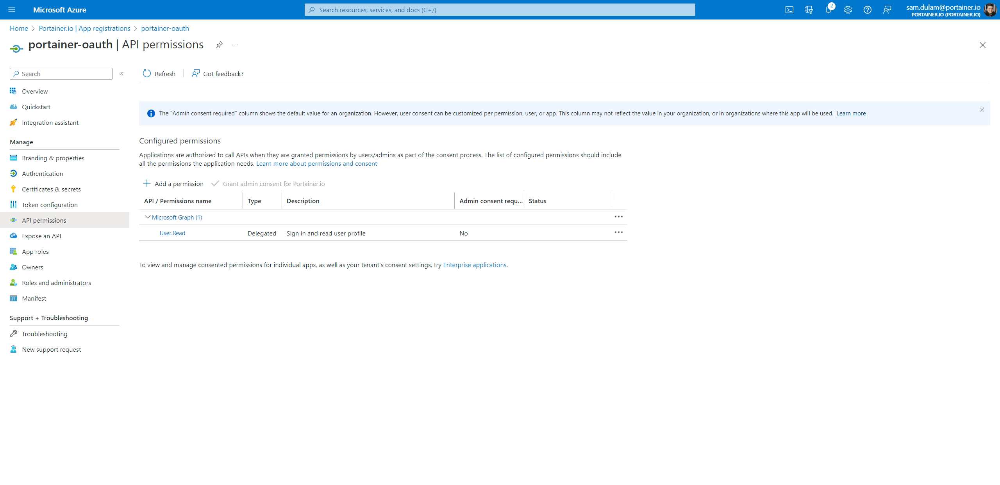<figcaption></figcaption></figure>
7.  Make sure you Grant admin consent for Directory.\

    <figure><figcaption></figcaption></figure>
8.  Optionally, to use **Automatic Team Membership** ability in Portainer, you need create groups claim. Click on **Token Configuration** and **Add groups claim**. Select **Security Groups** and click **Add**.

    <figure>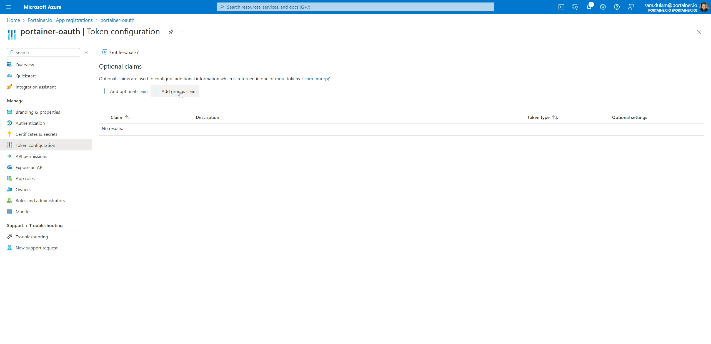<figcaption></figcaption></figure>

<figure>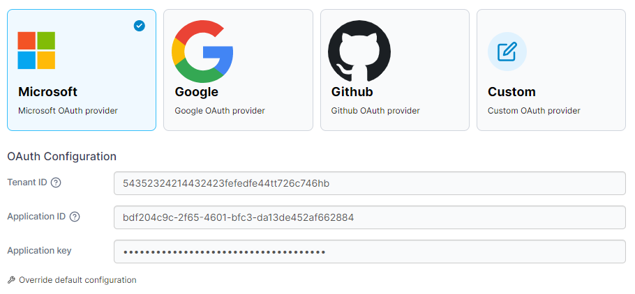<figcaption></figcaption></figure>

When you're finished, click **Save settings**.

### Google

Configure your OAuth provider using the table below as a guide.

| Field/Option  | Overview                                              |
| ------------- | ----------------------------------------------------- |
| Client ID     | Enter the public identifier of the OAuth application. |
| Client secret | Enter the secret key for the OAuth application.       |

<figure>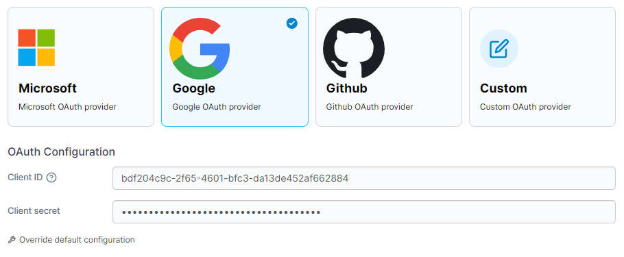<figcaption></figcaption></figure>

When you're finished, click **Save settings**.

### Github

Configure your OAuth provider using the table below as a guide.

| Field/Option  | Overview                                              |
| ------------- | ----------------------------------------------------- |
| Client ID     | Enter the public identifier of the OAuth application. |
| Client secret | Enter the secret key for the OAuth application.       |

<figure>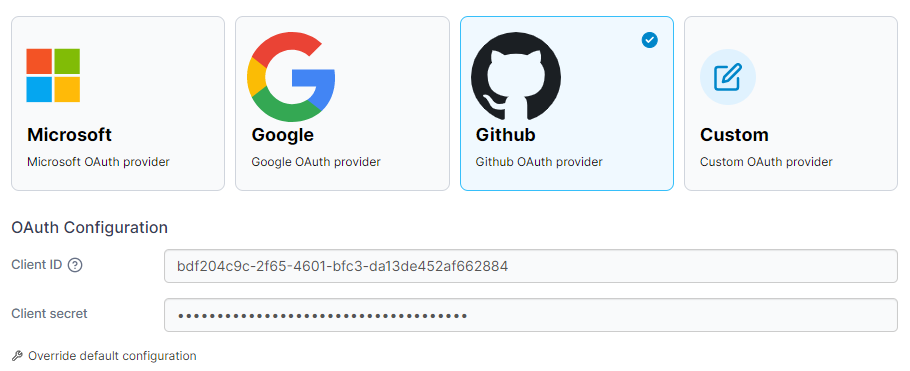<figcaption></figcaption></figure>

When you're finished, click **Save settings**.

### Custom

Complete the **OAuth Configuration** section based on the table below.

| Field/Option      | Overview                                                                                                                                                                                         |
| ----------------- | ------------------------------------------------------------------------------------------------------------------------------------------------------------------------------------------------ |
| Client ID         | Enter the public identifier of the OAuth application.                                                                                                                                            |
| Client secret     | Enter the token access to the OAuth application.                                                                                                                                                 |
| Authorization URL | Enter the URL used to authenticate against the OAuth provider (will redirect users to the OAuth provider login screen).                                                                          |
| Access token URL  | Enter the URL used to exchange a valid OAuth authentication code for an access token.                                                                                                            |
| Resource URL      | Enter the URL used by Portainer to retrieve information about authenticated users.                                                                                                               |
| Redirect URL      | Enter the URL used by the OAuth provider to redirect users after they are successfully authenticated (also referred to as the callback URL). You should set this to your Portainer instance URL. |
| Logout URL        | Enter the URL used by the OAuth provider to log users out.                                                                                                                                       |
| User identifier   | Enter the identifier that Portainer will use to create accounts for authenticated users. Retrieved from the resource server specified in the **Resource URL** field.                             |
| Scopes            | Required by the OAuth provider to retrieve information about authenticated users. See your provider's own documentation for more information.                                                    |

<figure>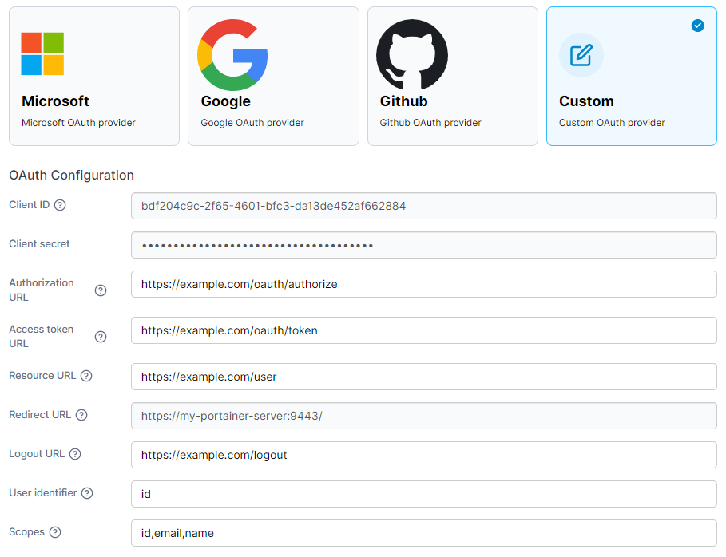<figcaption></figcaption></figure>

When you're finished, click **Save settings**.

## Giving environment access to OAuth teams and users

See [Managing user access to environments](../../environments/access.md).
