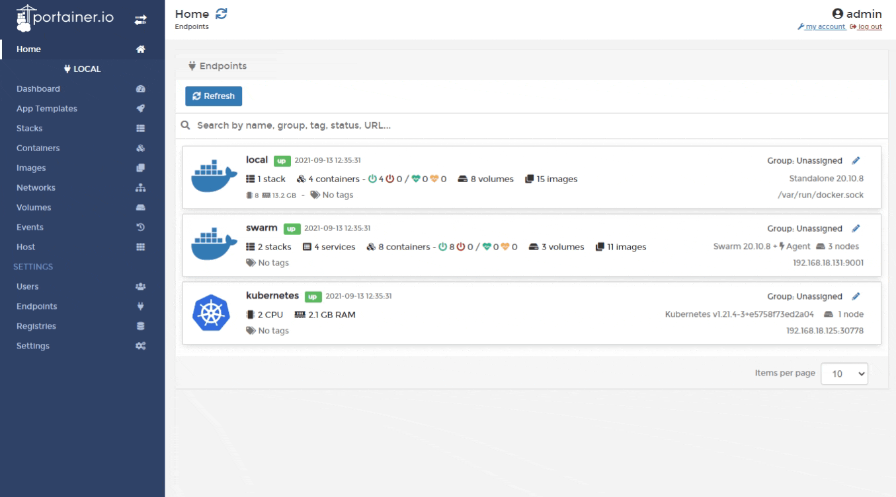
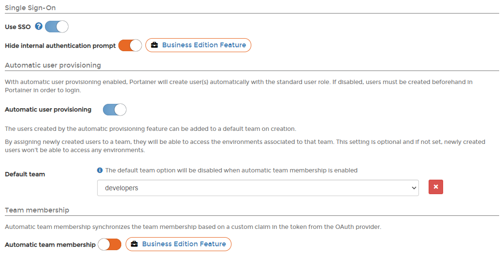
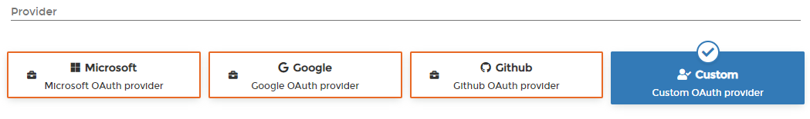
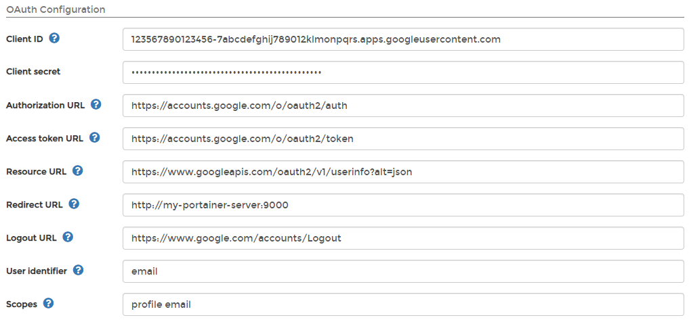
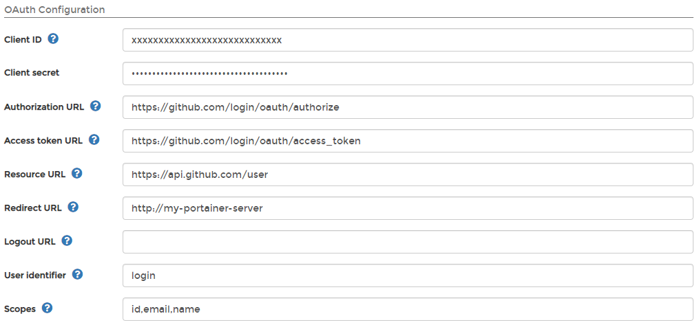
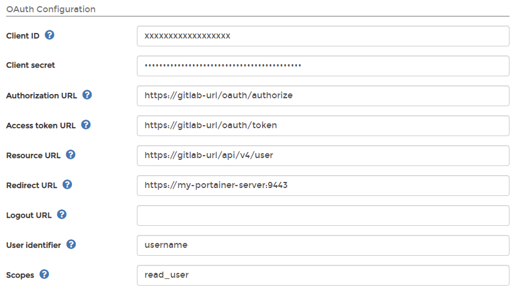
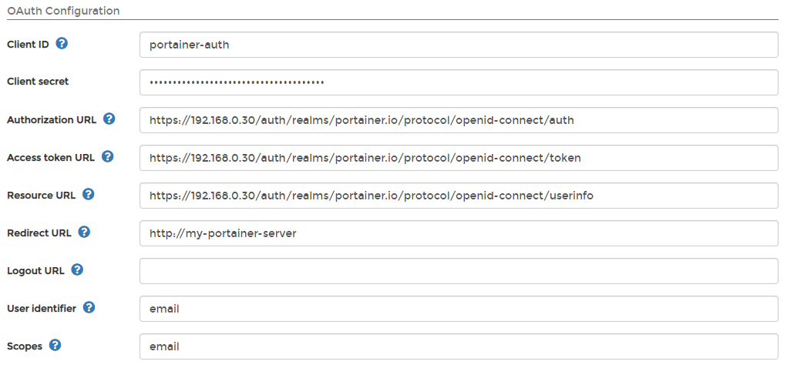

# Authenticate via OAuth

## Configuring OAuth authentication in Portainer

From the menu select **Settings** then select **Authentication**. Under the **Authentication method** section click **OAuth**.

In the next screen, enter the credentials provided by your OAuth provider, using the table below as a guide.

| Field/Option                        | Overview                                                                                                                                                                                                                                                                      |
| ----------------------------------- | ----------------------------------------------------------------------------------------------------------------------------------------------------------------------------------------------------------------------------------------------------------------------------- |
| Use SSO                             | Enable SSO so that the OAuth provider won't be forced to ask for credentials when users are in a current logged-in session.                                                                                                                                                   |
| Hide internal authentication prompt | Hide the ability to log in through internal authentication. This feature is only available in [Portainer Business Edition](https://www.portainer.io/business-upsell?from=hide-internal-auth).                                                                                 |
| Automatic user provisioning         | If toggled on, users who exist at the OAuth provider's end will automatically be created in Portainer (you can define a default team to put those users in while this option is on). If toggled off, you'll need to [create users](../../users/add.md) in Portainer manually. |
| Automatic team membership           | This synchronizes the team members based on a custom claim in the token from the OAuth provider. This feature is only available in [Portainer Business Edition](https://www.portainer.io/business-upsell?from=hide-internal-auth).                                            |

Select your OAuth provider from the options.


Pre-filled templates for Microsoft, Google and Github are available in [Portainer Business Edition](https://www.portainer.io/business-upsell?from=hide-internal-auth).


Complete the **OAuth Configuration** section based on the table below.

| Field/Option      | Overview                                                                                                                                                                                         |
| ----------------- | ------------------------------------------------------------------------------------------------------------------------------------------------------------------------------------------------ |
| Client ID         | Enter the public identifier of the OAuth application.                                                                                                                                            |
| Client secret     | Enter the token access to the OAuth application.                                                                                                                                                 |
| Authorization URL | Enter the URL used to authenticate against the OAuth provider (will redirect users to the OAuth provider login screen).                                                                          |
| Access token URL  | Enter the URL used to exchange a valid OAuth authentication code for an access token.                                                                                                            |
| Resource URL      | Enter the URL used by Portainer to retrieve information about authenticated users.                                                                                                               |
| Redirect URL      | Enter the URL used by the OAuth provider to redirect users after they are successfully authenticated (also referred to as the callback URL). You should set this to your Portainer instance URL. |
| Logout URL        | Enter the URL used by the OAuth provider to log users out.                                                                                                                                       |
| User identifier   | Enter the identifier that Portainer will use to create accounts for authenticated users. Retrieved from the resource server specified in the **Resource URL** field.                             |
| Scopes            | Required by the OAuth provider to retrieve information about authenticated users. See your provider's own documentation for more information.                                                    |

When you're finished, click **Save settings**.

## Giving endpoint access to OAuth teams and users

See [Managing user access to endpoints](../../environments/access.md).

## Examples

These examples show OAuth configuration for Azure, Google, GitHub, Gitlab and Keycloak.

* The client ID is known as 'application ID' in the MSFT world.
* The tenant ID (grayed information in the screenshot), is a GUID specific to your ID.

### Azure

### Google

### GitHub

### Gitlab

Create an application in the admin area of Gitlab. Select `read_user` as the scope, make it trusted and make sure the call-back URL is the full Portainer URL.

### Keycloak

