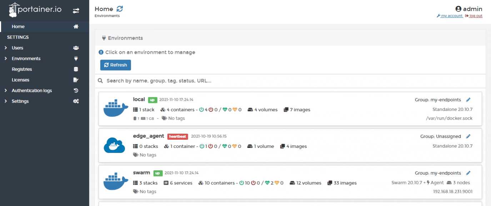
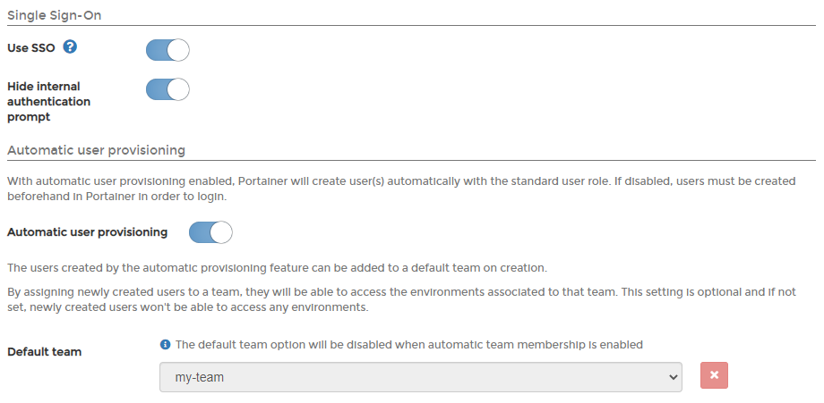
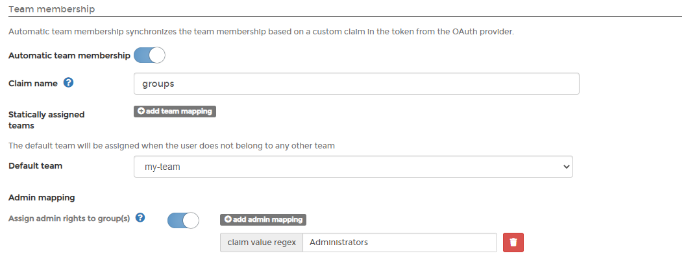
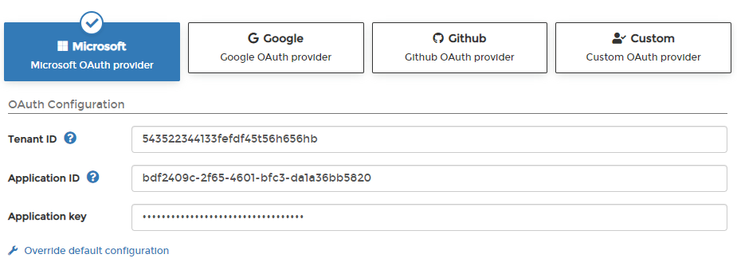
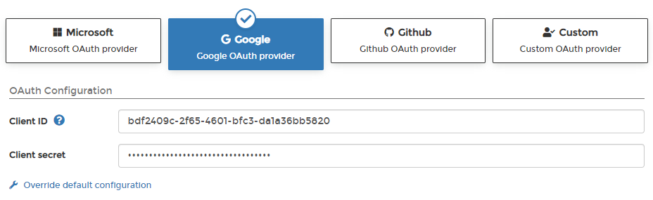
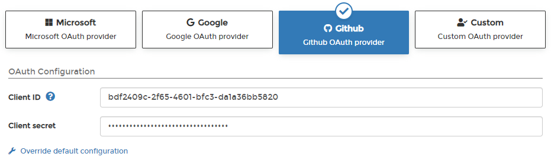
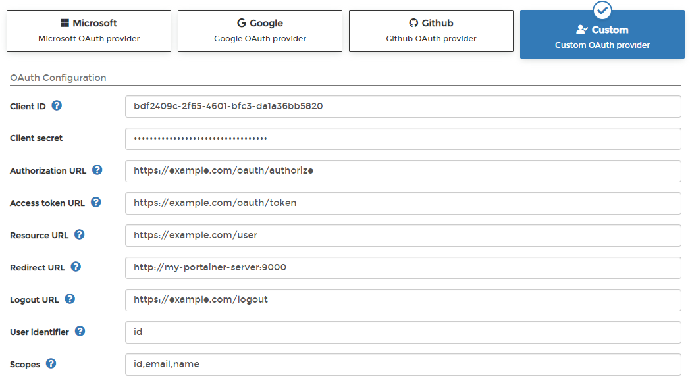

# Authenticate via OAuth

## Configuring OAuth authentication in Portainer

From the menu select **Settings** then select **Authentication**. Under the **Authentication method** section click **OAuth**.

In the next screen, enter the credentials provided by your OAuth provider, using the table below as a guide.

| Field/Option                        | Overview                                                                                                                                                                                                                                                                      |
| ----------------------------------- | ----------------------------------------------------------------------------------------------------------------------------------------------------------------------------------------------------------------------------------------------------------------------------- |
| Use SSO                             | Enable SSO so that the OAuth provider won't be forced to ask for credentials when users are in a current logged-in session.                                                                                                                                                   |
| Hide internal authentication prompt | Hide the ability to log in through internal authentication.                                                                                                                                                                                                                   |
| Automatic user provisioning         | If toggled on, users who exist at the OAuth provider's end will automatically be created in Portainer (you can define a default team to put those users in while this option is on). If toggled off, you'll need to [create users](../../users/add.md) in Portainer manually. |

If you toggle **Automatic team membership** on, you can choose to automatically add OAuth users to certain Portainer teams based on the **Claim name**. Claim names will be matched with teams or you can manually link a claim name (using regex) with Portainer teams under the **Statically assigned teams** option. You can also define a **Default team** for users who don't belong to any other team.

In addition, you can enable the automatic assignment of admin rights to specified groups if desired.

## OAuth providers

Portainer provides pre-configured OAuth provider options or you can set up your own custom OAuth provider. Each of the pre-configured providers can have their configuration overridden if you need to make changes to the Portainer defaults.

### Microsoft

Configure your OAuth provider using the table below as a guide.

| Field/Option    | Overview                                                                                                      |
| --------------- | ------------------------------------------------------------------------------------------------------------- |
| Tenant ID       | Enter the ID of the Azure Directory you wish to authenticate against. This is also known as the Directory ID. |
| Application ID  | Enter the public identifier of the OAuth application.                                                         |
| Application key | Enter the secret key for the OAuth application.                                                               |

When you're finished, click **Save settings**.

### Google

Configure your OAuth provider using the table below as a guide.

| Field/Option  | Overview                                              |
| ------------- | ----------------------------------------------------- |
| Client ID     | Enter the public identifier of the OAuth application. |
| Client secret | Enter the secret key for the OAuth application.       |

When you're finished, click **Save settings**.

### Github

Configure your OAuth provider using the table below as a guide.

| Field/Option  | Overview                                              |
| ------------- | ----------------------------------------------------- |
| Client ID     | Enter the public identifier of the OAuth application. |
| Client secret | Enter the secret key for the OAuth application.       |

When you're finished, click **Save settings**.

### Custom

Complete the **OAuth Configuration** section based on the table below.

| Field/Option      | Overview                                                                                                                                                             |
| ----------------- | -------------------------------------------------------------------------------------------------------------------------------------------------------------------- |
| Client ID         | Enter the public identifier of the OAuth application.                                                                                                                |
| Client secret     | Enter the token access to the OAuth application.                                                                                                                     |
| Authorization URL | Enter the URL used to authenticate against the OAuth provider (will redirect users to the OAuth provider login screen).                                              |
| Access token URL  | Enter the URL used to exchange a valid OAuth authentication code for an access token.                                                                                |
| Resource URL      | Enter the URL used by Portainer to retrieve information about authenticated users.                                                                                   |
| Redirect URL      | Enter the URL used by the OAuth provider to redirect users after they are successfully authenticated. You should set this to your Portainer instance URL.            |
| Logout URL        | Enter the URL used by the OAuth provider to log users out.                                                                                                           |
| User identifier   | Enter the identifier that Portainer will use to create accounts for authenticated users. Retrieved from the resource server specified in the **Resource URL** field. |
| Scopes            | Required by the OAuth provider to retrieve information about authenticated users. See your provider's own documentation for more information.                        |

When you're finished, click **Save settings**.

## Giving endpoint access to OAuth teams and users

See [Managing user access to endpoints](../../environments/access.md).
