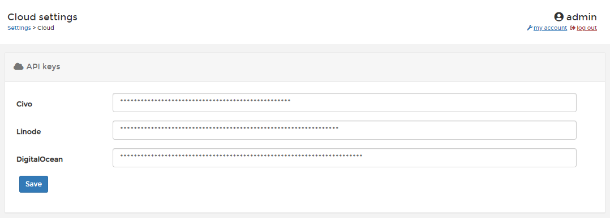

# Cloud

In this section you can configure the API keys used with our [KaaS provisioning functionality](../../start/install/agent/kubernetes/kaas.md).

Enter the API keys for your cloud services and click **Save** to update.
