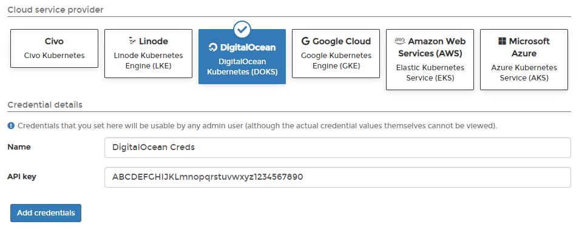

# Add DigitalOcean credentials

Before you can add your DigitalOcean credentials to Portainer, you will need to create an API token in your DigitalOcean account.

## Creating your API token

Log into the DigitalOcean dashboard and select **API** at the bottom left. Click **Generate New Token**, enter a token name and an expiration time, and ensure that both **Read** and **Write** scopes are ticked.

## Adding your credentials

To add credentials for a DigitalOcean account, from the [Cloud settings](./) page click **Add credentials**, then select the **DigitalOcean** option. Give your credential set a **name** and paste your **API key** into the box.

When you're ready, click **Add credentials**. Your credentials will now be available to you when [provisioning a Kubernetes cluster on DigitalOcean](../../../start/install/agent/kaas/digitalocean.md).
