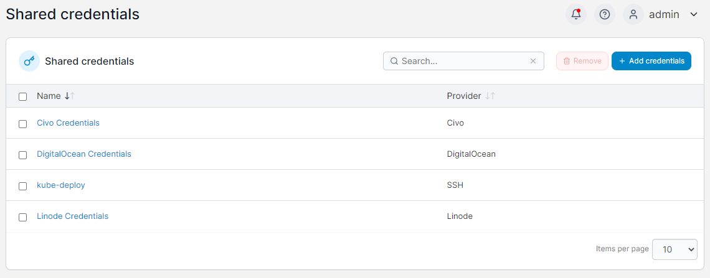

# Shared credentials

In this section you can manage the credentials used with our [KaaS provisioning functionality](../../environments/add/kaas/) and our Kubernetes provisioning feature.

<figure><figcaption></figcaption></figure>

To add a new set of credentials, click the **Add credentials** button. Portainer currently supports the following credential types:

* [Civo](civo.md)
* [Linode](linode.md)
* [DigitalOcean](digitalocean.md)
* [Google Cloud](gke.md)
* [Amazon Web Services (AWS)](eks.md)
* [Microsoft Azure](aks.md)
* [SSH](ssh.md) (for use with Kubernetes cluster deployments)

To remove a set of credentials, check the box next to the credentials to remove and click **Remove**.
