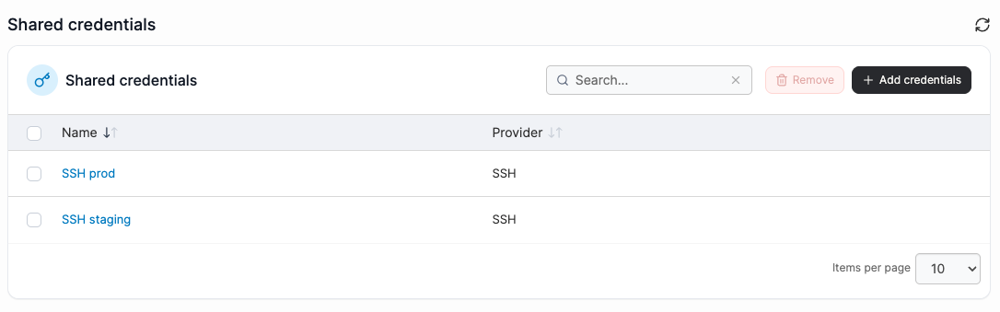
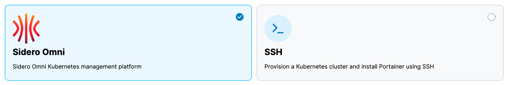

# Shared credentials

In this section you can create and manage credentials that are shared at admin level.&#x20;


The Shared credentials feature is only available in Portainer Business Edition.


<figure><figcaption></figcaption></figure>

To add a new set of credentials, click the **Add credentials** button.

<figure><figcaption></figcaption></figure>

Portainer currently supports the following credential types:

* [Sidero Omni](omni.md)
* [SSH](ssh.md) (for use with Kubernetes cluster deployments)

To remove a set of credentials, check the box next to the credentials to remove and click **Remove**.
