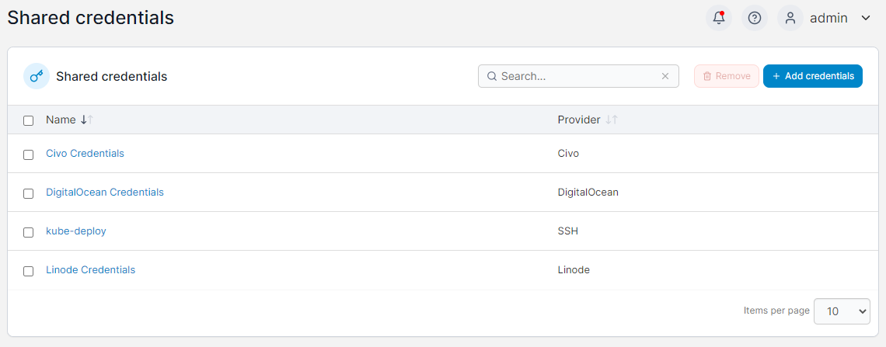

# Shared credentials

In this section you can create and manage credentials that are shared at admin level. Shared Git credentials can be used to connect to Git repositories, while the other shared credentials can be used with our [KaaS provisioning functionality](/broken/pages/75r7MwmKS8qoApxilQLj) and our Kubernetes provisioning feature.


The Shared credentials feature is only available in Portainer Business Edition.


<figure><figcaption></figcaption></figure>

To add a new set of credentials, click the **Add credentials** button.

<figure><figcaption></figcaption></figure>

Portainer currently supports the following credential types:

* [Sidero Omni](omni.md)
* [Civo](civo.md)
* [Akamai Connected Cloud](linode.md)
* [DigitalOcean](digitalocean.md)
* [Google Cloud](gke.md)
* [Amazon Web Services (AWS)](eks.md)
* [Microsoft Azure](aks.md)
* [SSH](ssh.md) (for use with Kubernetes cluster deployments)
* [Git](git.md)

To remove a set of credentials, check the box next to the credentials to remove and click **Remove**.
