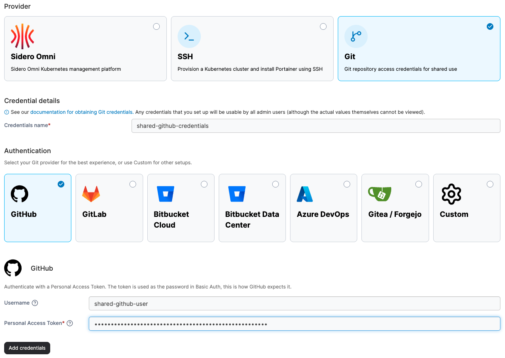

# Add Git credentials

Git credentials added here will be usable by any admin-level user, though they will not be able to view the actual credentials directly. Each credential is also restricted to the repository URL pattern(s) you configure for it — an admin can't use it against a repository outside that pattern.

### Adding your credentials 

To add your Git credentials, from the [Shared credentials](./) page click **Add credentials**, then select the **Git** option.

Enter a name for your shared credentials, then select your Git provider or select **Custom** if no options fit your authentication type. Fill in your Username and access token or password.


Ensure your token has repository read permissions (scopes), otherwise authentication will fail. See the [Git authentication token permissions FAQ ](../../../faqs/getting-started/what-scopes-are-required-for-github-gitlab-and-bitbucket-tokens.md)for more information.


<figure><figcaption></figcaption></figure>

Enter one or more comma-separated glob patterns in **Allowed repository URL pattern(s)**, for example `github.com/my-org/*`. This limits which repository URLs the credential can be used with — a pattern matches a single path segment, so `*` doesn't match across a `/`. Use `*` on its own to allow any repository.

Once you've entered the relevant details, click **Add credentials** to save the entry.


Credentials created before this restriction was added continue to work without a URL pattern until you next edit them — at that point a pattern is required.

