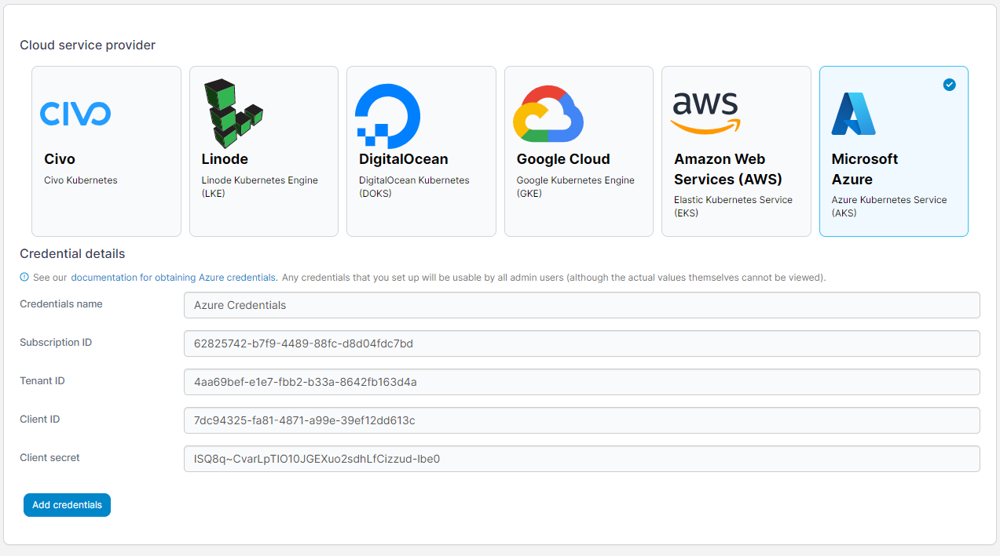

# Add Azure credentials

Before you can add your Azure credentials to Portainer, you will need to retrieve your subscription ID, create an app and retrieve the related tenant ID and client ID, create a client secret and retrieve the value, and set the correct role or permissions on your resource group.

## Configuring your Azure account

Log in to the Azure portal. First, click **Subscriptions** and note down your **Subscription ID**.&#x20;

Then click the menu in the top left and select **Azure Active Directory**. Click **App registrations** in the left hand menu and select **New Registration**.

Enter a name for your registration that makes sense to you and leave the other fields as they are. Click **Register** to create the registration. In the app page that appears, note down the **Application (client) ID** and **Directory (tenant) ID**.

Next click on **Certificates & secrets** in the left hand menu. Click **New client secret** and enter a name for your secret. Select an expiry date for the secret and click **Add**. Copy the **Client Secret (value)** - you don't need the secret ID.

Now we need to set permissions. Click the menu in the top left, then **Resource Groups** and select your resource group. If you don't already have one, you can create a new one.&#x20;

Click on **Access control (IAM)** in the left hand menu then click **Add role assignment**. We recommend selecting the `Contributor` role, but if you want to specify the exact set of permissions they are as follows:

```
Microsoft.ContainerService/managedClusters/read
Microsoft.ContainerService/managedClusters/write
Microsoft.Resources/deployments/*
Microsoft.Resources/subscriptions/resourcegroups/read
Microsoft.Resources/subscriptions/resourcegroups/write
Microsoft.Resources/subscriptions/read
Microsoft.ContainerService/managedClusters/listClusterAdminCredential/action
```

Once you've chosen your permissions, click **Next**. Click **Select members** then search for the app you registered earlier. Click it, then click **Select** at the bottom of the page. Click **Review + assign**, then **Review + assign** again on the next page.

## Adding your credentials

To add credentials for an Azure account, from the [Cloud settings](./) page click **Add credentials**, then select the **Microsoft Azure** option. Enter a **name** for your credentials, then paste your **Subscription ID**, **Tenant ID**, **Client ID** and **Client Secret** into the fields.

<figure><figcaption></figcaption></figure>

When you're ready, click **Add credentials**. Your credentials will now be available to you when [provisioning a Kubernetes cluster on Azure](../../environments/add/kaas/aks.md).
