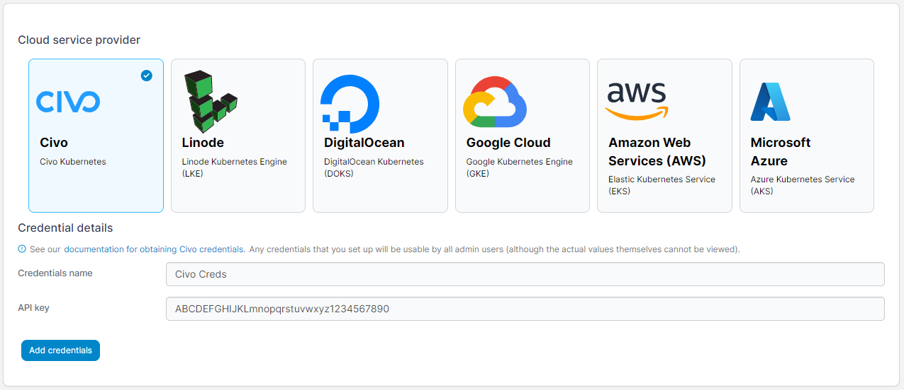

# Add Civo credentials

Before you can add your Civo credentials to Portainer, you will need to retrieve your API token from Civo.

## Retrieving your API token

Log into the Civo dashboard and expand the **Settings** menu. Select **Profile**, then the **Security** tab.

At the top of the page you should see your API key listed.

## Adding your credentials

To add credentials for a Civo account, from the [Shared credentials](./) page click **Add credentials**, then select the **Civo** option. Give your credential set a **name** and paste your **API key** into the box.

<figure><figcaption></figcaption></figure>

When you're ready, click **Add credentials**. Your credentials will now be available to you when [provisioning a Kubernetes cluster on Civo](../../environments/add/kaas/civo.md).
