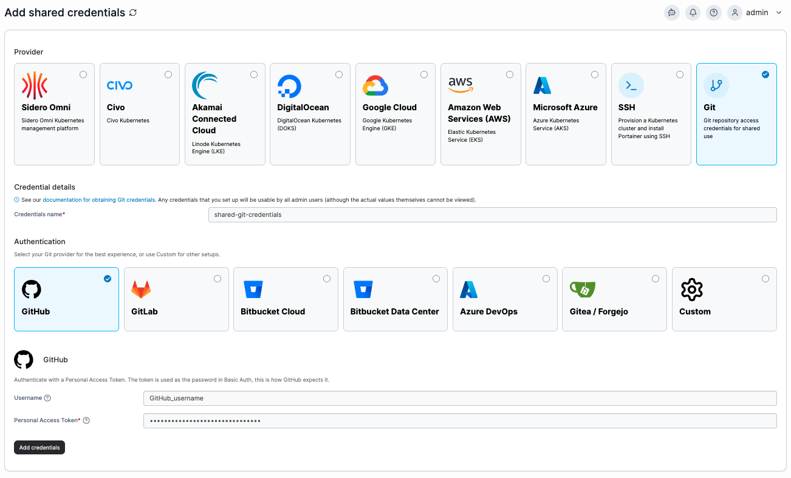

---
metaLinks:
  alternates:
    - >-
      https://app.gitbook.com/s/MdgxA76kWxcRmwybM8Ft/admin/settings/credentials/git
---

# Add Git credentials

Git credentials added here will be usable by any admin-level user, though they will not be able to view the actual credentials directly.

## Adding your credentials

To add your Git credentials, from the [Shared credentials](https://docs.portainer.io/admin/settings/credentials) page click **Add credentials**, then select the **Git** option.&#x20;

Enter a name for your shared credentials, then select your Git provider or select **Custom** if no options fit your authentication type. Fill in your Username and access token or password.&#x20;


Ensure your token has repository read permissions (scopes), otherwise authentication will fail. See the [Git authentication token permissions FAQ](../../../faqs/getting-started/what-scopes-are-required-for-github-gitlab-and-bitbucket-tokens.md) for more information.


<figure><figcaption></figcaption></figure>

Once you've entered the relevant details, click **Add credentials** to save the entry.
