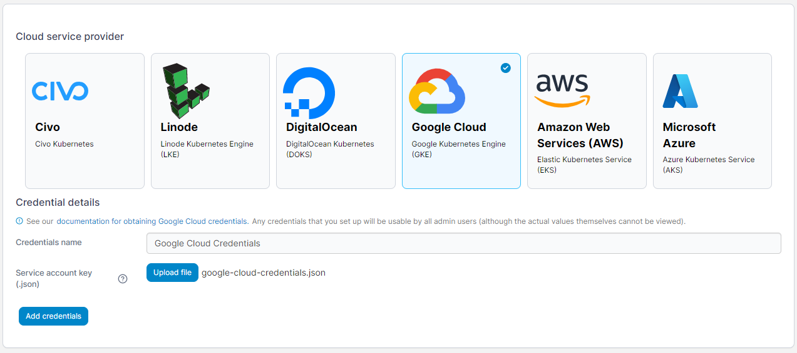

# Add Google Cloud credentials

Before you can add your Google Cloud credentials to Portainer, you will need to configure your account for GKE, set up a service account, and retrieve the private key for that service account. Once this is complete, you can use the private key to set up access.

## Creating your private key

Log into the Google Cloud console and go to the dashboard for your project. To confirm GKE is enabled for your project, click on **Kubernetes Engine** in the left hand menu. If the section loads and displays the ability to create a cluster, you're set up already. Otherwise you'll be asked to **enable the Kubernetes Engine API**, which you should do.

Once this is confirmed, we need to create a service account. From the navigation menu, hover over **IAM & Admin** and click **Service Accounts**, then click **Create Service Account**. Fill in the service account details with a name, ID and description that makes sense to you and click **Create and Continue**. In the **Grant this service account access to project** section, add the`Compute Engine Service Agent` and `Kubernetes Engine Service Agent` roles to the service account and click **Continue**, then click **Done** to create the account.

Finally, we need to retrieve the private key for the service account. Click on the service account you just created, then select the **Keys** tab and click **Add Key** then **Create new key**. Select **JSON** as the type and click **Create**. This will download a file containing the private key for the service account.

## Adding your credentials

To add credentials for a Google Cloud account, from the [Shared credentials](./) page click **Add credentials**, then select the **Google Cloud** option. Give your credential set a **name** and upload the JSON private key for your service account.

<figure><figcaption></figcaption></figure>

When you're ready, click **Add credentials**. Your credentials will now be available to you when [provisioning a Kubernetes cluster on Google Cloud](../../environments/add/kaas/gke.md).
