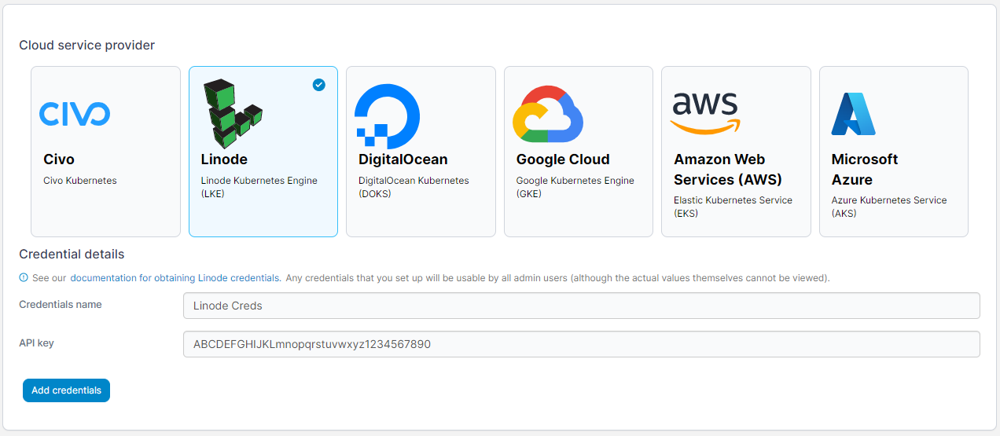

# Add Linode credentials

Before you can add your Linode credentials to Portainer, you will need to create an API token in your Linode account.

## Creating your API token

Log into the Linode dashboard and click your account name in the top right. Select **API Tokens**. Click **Create a Personal Access Token**, give it a label and set an expiry. The Portainer provisioning functionality only requires **Read/Write** for the **Kubernetes** option, so disable the rest.

## Adding your credentials

To add credentials for a Linode account, from the [Shared credentials](./) page click **Add credentials**, then select the **Linode** option. Give your credential set a **name** and paste your **API key** into the box.

<figure><figcaption></figcaption></figure>

When you're ready, click **Add credentials**. Your credentials will now be available to you when [provisioning a Kubernetes cluster on Linode](../../environments/add/kaas/linode.md).
