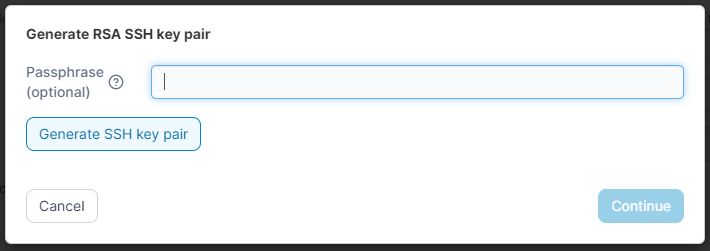
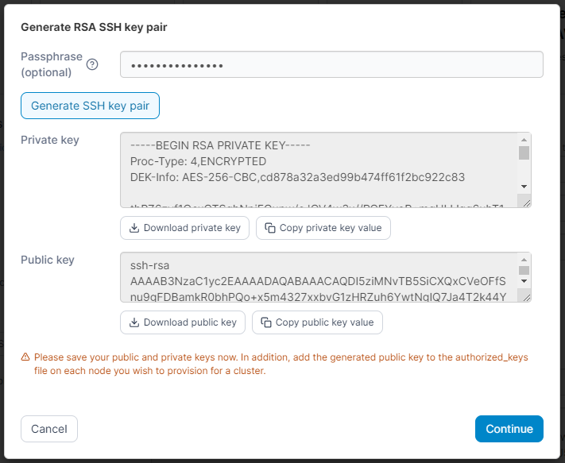

# Add SSH credentials

SSH credentials are currently used by Portainer in our Kubernetes provisioning feature. Credentials created here will be usable by any admin-level user, though they will not be able to view the actual credentials directly.

## Setting up your SSH user

The exact method for configuring your SSH user will differ from platform to platform. For the Kubernetes provisioning feature, we assume the following for the user you create:

* The user has sudo privileges or is a root user - this is because Portainer needs this level of access in order to install Kubernetes.
* SSH is listening on port `22` on the server.

We generally recommend the use of a SSH key for authentication rather than password authentication, but Portainer supports both methods.

## Adding your credentials

To add your SSH credentials, from the [Shared credentials](./) page click **Add credentials**, then select the **SSH** option. Fill out the relevant fields as below.

| Field/Option               | Overview                                                                                                             |
| -------------------------- | -------------------------------------------------------------------------------------------------------------------- |
| Credentials name           | Enter a name you will use to identify your credential set in the Portainer application.                              |
| SSH username               | Enter the username for your SSH account.                                                                             |
| SSH password               | Enter the password for your SSH account. You can leave this field blank if you intend to use SSH key authentication. |
| Use SSH key authentication | Enable this toggle to use SSH key authentication instead of password authentication.                                 |
| SSH private key passphrase | If your SSH private key is encrypted, provide the passphrase here.                                                   |
| SSH private key            | Paste your SSH private key in this field.                                                                            |

<figure><figcaption></figcaption></figure>

You can also choose to upload your private key by clicking **Upload SSH private key** and selecting the file to upload. This will replace anything in the SSH private key field with the contents of the uploaded file.

When you are ready, click **Add credentials** to complete the process.

### Generate a new key pair

If you would like to create a new key pair for your SSH credentials, you can do so by clicking **Generate new RSA SSH key pair**. You will first be prompted to enter an optional passphrase for your private key, then click the **Generate SSH key pair** button to proceed.

<figure><figcaption></figcaption></figure>

Portainer will then generate a new key pair for you and display the resulting private and public keys. You can copy the values to your clipboard with the Copy buttons, or download the individual files with the Download buttons.


Ensure you take a copy of both the public and private keys, as you will not be able to retrieve them.


<figure><figcaption></figcaption></figure>

Your newly generated public key should be added to the `authorized_keys` file for the SSH user you intend to use on your nodes for provisioning.


Key pairs are generated with a key size of `4096` bits.


Once you have saved the public and private key files, click **Continue**. You will be returned to the previous screen and the SSH private key passphrase and SSH private key fields will be populated with your new key pair's passphrase and private key respectively.
