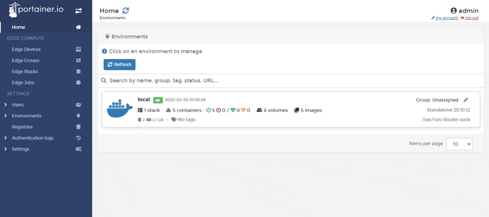
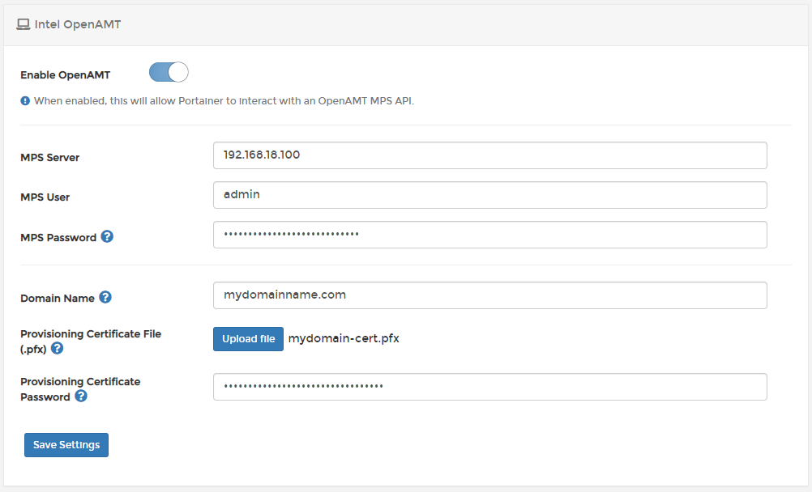
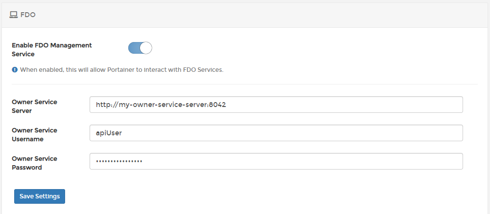
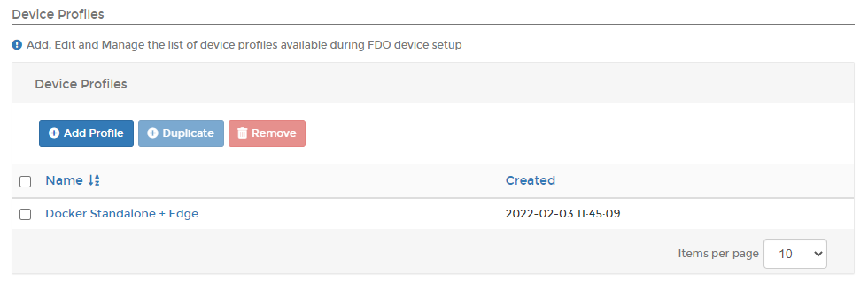
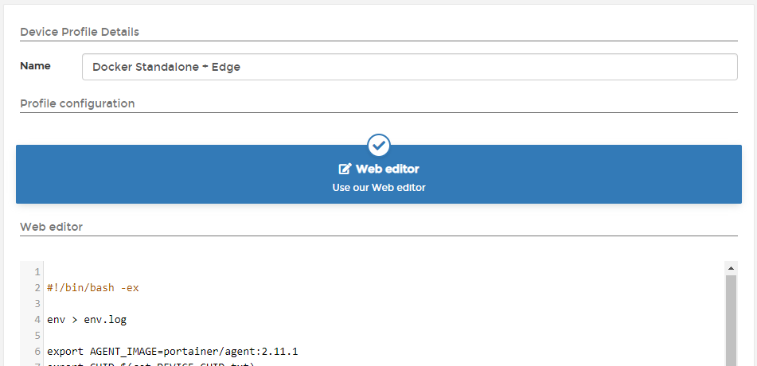

# Edge Compute

To enable and configure Edge Compute functionality in Portainer, select **Settings** from the menu then select **Edge Compute**.&#x20;


To learn how to use our Edge Compute functionality, please refer to the [Edge Compute](../../user/edge/) section of this documentation.


## Edge Compute settings

Use the following options to configure and enable Edge Compute functionality within Portainer.

| Field/Option                      | Overview                                                                                                                                                                                                                                                                                        |
| --------------------------------- | ----------------------------------------------------------------------------------------------------------------------------------------------------------------------------------------------------------------------------------------------------------------------------------------------- |
| Edge agent default poll frequency | Select the interval used by default by each Edge Agent to check in with the Portainer Server instance. The default value is to check in every 5 seconds.                                                                                                                                        |
| Enable Edge Compute features      | Toggle this on to enable Edge Compute functionality including Edge Device features.                                                                                                                                                                                                             |
| Enforce environment ID            | Enable this option to require that the environment ID used by an Edge Agent deployment exist within Portainer's database (in other words, have an environment with the matching ID already created) in order to connect.                                                                        |
| Trust on first connect            | By default, when an Edge Agent first connects to the Portainer instance, Portainer will automatically trust the Edge Agent. You can disable this automatic trust by toggling this option off. When this option is off, you will have to manually accept Edge Agent associations with Portainer. |

When you are done, click **Save Settings**.

## Intel OpenAMT

This section controls the configuration of the [Intel OpenAMT](../../user/edge/devices/openamt.md) functionality in Portainer.

| Field/Option                         | Overview                                                                                                                                                                                                                                         |
| ------------------------------------ | ------------------------------------------------------------------------------------------------------------------------------------------------------------------------------------------------------------------------------------------------ |
| Enable OpenAMT                       | Toggle this option on to enable Portainer's OpenAMT functionality. This can only be enabled when **Enable Edge Compute features** is toggled on, and when on will reveal the below fields.                                                       |
| MPS Server                           | Enter the FQDN or IP address of your MPS server.                                                                                                                                                                                                 |
| MPS User                             | Enter the username used to connect to your MPS server.                                                                                                                                                                                           |
| MPS Password                         | Enter the password for the MPS User defined above. The password must be between 8 and 32 characters and include at least one upper case letter, at least one lower case letter, at least one base-10 digit and at least one special character.   |
| Domain Name                          | Enter the fully-qualified domain name associated with the provisioning certificate.                                                                                                                                                              |
| Provisioning Certificate File (.pfx) | 
Click Upload file to upload your PFX-format certificate. The PFX must contain the private key. On AMT 15 based devices you must use SHA2.  Currently supported CAs are Comodo, DigiCert, Entrust and GoDaddy.
                       |
| Provisioning Certificate Password    | Enter the password for the provisioning certificate. The password must be between 8 and 32 characters and include at least one upper case letter, at least one lower case letter, at least one base-10 digit and at least one special character. |

When you have finished making changes, click **Save Settings**.

## FDO

This section controls the configuration of the [FDO functionality](../../user/edge/devices/fdo.md) in Portainer.

| Field/Option                  | Overview                                                                                                                                                                               |
| ----------------------------- | -------------------------------------------------------------------------------------------------------------------------------------------------------------------------------------- |
| Enable FDO Management Service | Toggle this option on to enable Portainer's FDO functionality. This can only be enabled when **Enable Edge Compute features** is toggled on, and when on will reveal the below fields. |
| Owner Service Server          | Enter the address and port of your Owner Service Server.                                                                                                                               |
| Owner Service Username        | Enter the username used to connect to your Owner Service Server.                                                                                                                       |
| Owner Service Password        | Enter the password associated with the username above.                                                                                                                                 |

When you have finished configuring your FDO setup, click **Save Settings**.

### Device Profiles

Here you can add, edit and manage the device profiles available for use during FDO device setup. A device profile consists of a script that is run on the device when first provisioned by the FDO system, and can be used for initial installation and configuration of the device, for example installing Docker and deploying the Portainer Edge Agent.

To create a new profile, click **Add Profile**. To edit an existing profile, click the name of the profile you want to edit. You can also check the box next to a profile and click **Duplicate** to create a copy of it, and **Remove** to delete the profile.

Device profiles consist of a unique name and the contents of the script. Use the **Web editor** to create or edit your script.

Once you've finished with your script, click **Save Profile**.
