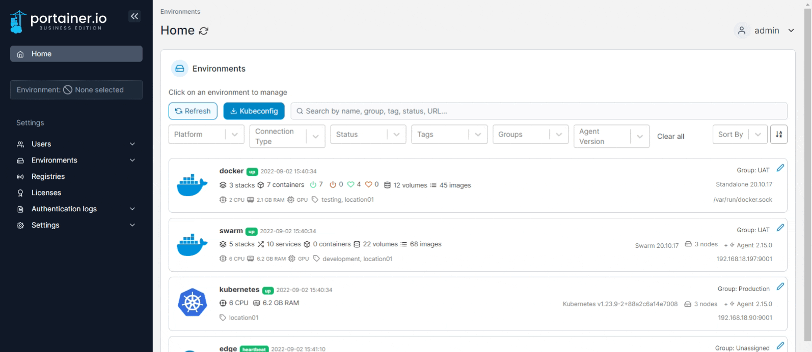
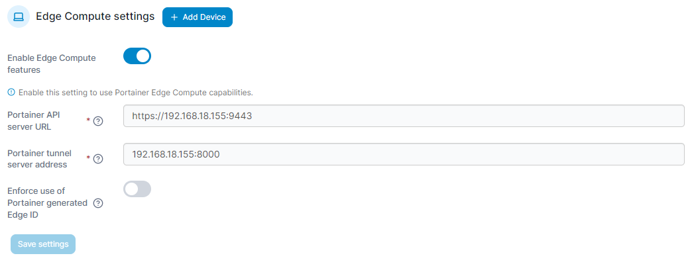
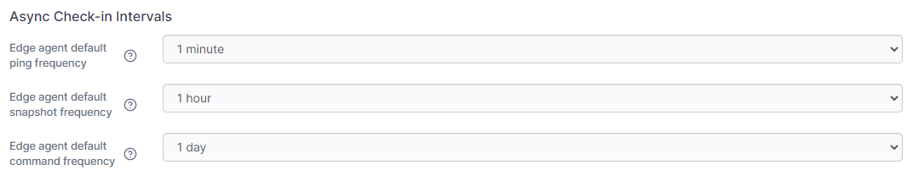
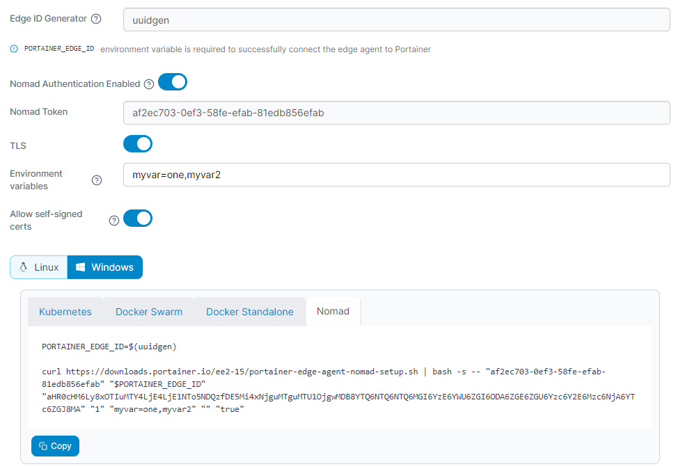
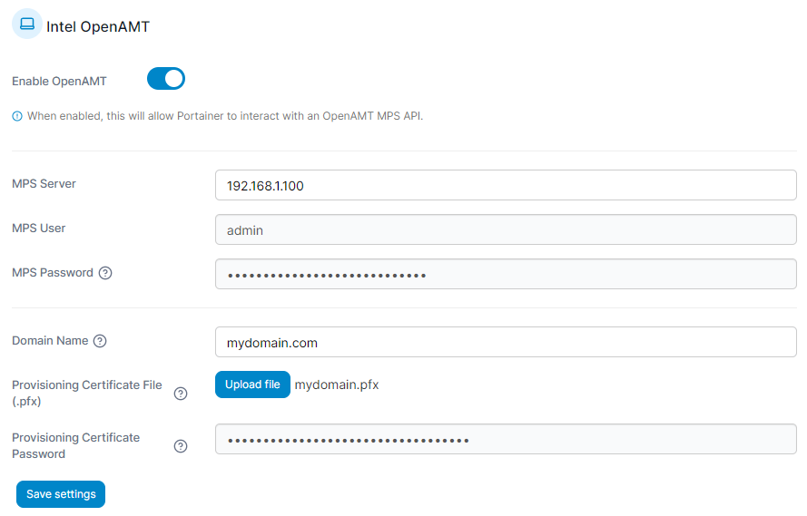
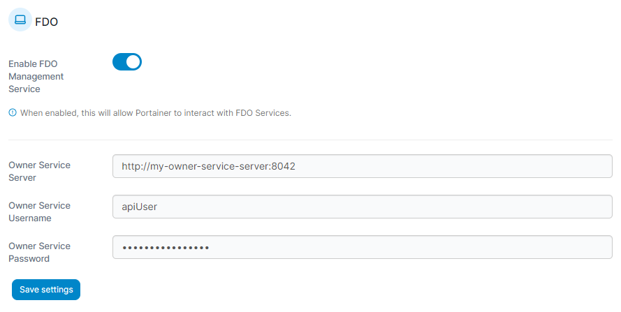
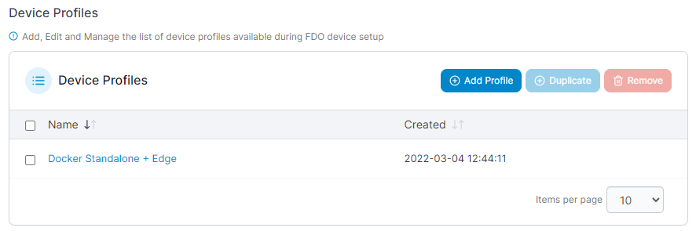
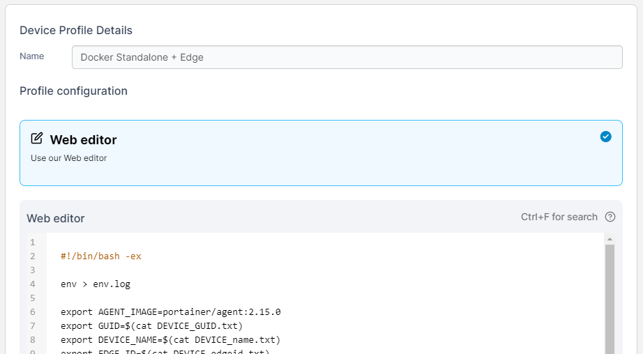

# Edge Compute

To enable and configure Edge Compute functionality in Portainer, select **Settings** from the menu then select **Edge Compute**.&#x20;


To learn how to use our Edge Compute functionality, please refer to the [Edge Compute](../../../user/edge/) section of this documentation.


<figure><figcaption></figcaption></figure>

## Edge Compute settings

In this section you can add new Edge Devices by clicking Add device. Use the following options to configure and enable Edge Compute functionality within Portainer.

| Field/Option                               | Overview                                                                                                                                                                                                                                                                                                                                                                                                                            |
| ------------------------------------------ | ----------------------------------------------------------------------------------------------------------------------------------------------------------------------------------------------------------------------------------------------------------------------------------------------------------------------------------------------------------------------------------------------------------------------------------- |
| Enable Edge Compute features               | Toggle this on to enable Edge Compute functionality including Edge Device features.                                                                                                                                                                                                                                                                                                                                                 |
| Portainer API server URL                   | 
Enter the default URL and port of your Portainer Server instance as it will be seen from your Edge environment. If using a FQDN, ensure that DNS is properly configured to provide this. This value can be overridden when manually deploying an Edge Agent.
                                                                                                                                                              |
| Portainer tunnel server address            | 
Enter the default address and port of your Portainer Server instance's tunnel server as it will be seen from your Edge environment. If using a FQDN, ensure that DNS is properly configured to provide this. In most cases, this will be the same address as the Portainer API server URL, but without the protocol and on port <code>8000</code>. This value can be overridden when manually deploying an Edge Agent.
 |
| Enforce use of Portainer generated Edge ID | Enable this option to require that the Edge ID used by an Edge Agent deployment exist within Portainer's database (in other words, have an environment with the matching ID already created) in order to connect.                                                                                                                                                                                                                   |

<figure><figcaption></figcaption></figure>

When you are done, click **Save Settings**.

## Deployment sync options

This section defines options that apply how Edge Agents sync with the Portainer Server instance.

### Check-in intervals

| Field/Option                      | Overview                                                                                                                                                                                                                                                                                                           |
| --------------------------------- | ------------------------------------------------------------------------------------------------------------------------------------------------------------------------------------------------------------------------------------------------------------------------------------------------------------------ |
| Edge agent default poll frequency | Select how often Edge Agents check in with the Portainer Server instance.                                                                                                                                                                                                                                          |
| Use Async mode by default         | Toggle this on to enable Async mode for Edge Devices. Async mode disables the tunnel between the Edge Device and the Portainer server instance. When Async mode is enabled, individual values can be set for the poll, ping, snapshot frequencies for Edge Devices, and browsing the device is done via snapshots. |

<figure><figcaption></figcaption></figure>

### Async Check-in intervals

The following options will appear when **Use Async mode by default** is enabled above.

| Field/Option                          | Overview                                                                                                                                |
| ------------------------------------- | --------------------------------------------------------------------------------------------------------------------------------------- |
|                                       |                                                                                                                                         |
| Edge agent default poll frequency     | When Async mode is disabled, use this option to set how often Edge Agents check in with the Portainer Server instance.                  |
| Edge agent default ping frequency     | When Async mode is enabled, use this option to set how often Edge Agents ping back to the Portainer Server instance.                    |
| Edge agent default snapshot frequency | When Async mode is enabled, use this option to set how often Edge Agents updates the snapshot with the Portainer Server instance.       |
| Edge agent default command frequency  | When Async mode is enabled, use this option to set how often Edge Agents check with the Portainer Server instance for pending commands. |

<figure><figcaption></figcaption></figure>

When you are done, click **Save Settings**.

## Automatic Edge Environment Creation

In this section you can configure how automatic Edge environment configuration functions as well as customize and retrieve your Edge agent deployment script, for use when preloading Edge Devices with a Portainer Edge Agent container and configuration.

| Field/Option                          | Overview                                                                                                                                                                                                                                                                                |
| ------------------------------------- | --------------------------------------------------------------------------------------------------------------------------------------------------------------------------------------------------------------------------------------------------------------------------------------- |
| Disable Edge Environment Waiting Room | Toggle this on to disable the [waiting room](../../../user/edge/waiting-room.md) feature for Edge devices. This will allow any Edge Device that connects to the Portainer instance to automatically associate with Portainer. We recommend leaving this off (the waiting room enabled). |

<figure><figcaption></figcaption></figure>

Configure the options and select the platform (Linux or Windows) to generate your Edge agent deployment scripts.

| Field/Option                 | Overview                                                                                                                                               |
| ---------------------------- | ------------------------------------------------------------------------------------------------------------------------------------------------------ |
| Edge ID Generator            | Provide a one-line script that will be used to generate a unique ID for your Edge devices. For Linux, an example would be using the `uuidgen` command. |
| Nomad Authentication Enabled | If you have selected a Nomad environment, toggle this to enable authentication.                                                                        |
| Nomad Token                  | If Nomad authentication is enabled, define the Nomad token to use.                                                                                     |
| TLS                          | Toggle this on if your Nomad installation uses TLS.                                                                                                    |
| Environment variables        | Define a comma separated list of environment variables that will be sourced from the Edge device for use in Portainer.                                 |
| Allow self-signed certs      | Toggle this to permit the use of self-signed certificates for the communication between the Edge Agent and the Portainer server.                       |

<figure><figcaption></figcaption></figure>

Select the environment of your deployment and click **Copy** to copy the script to your clipboard.

## Intel OpenAMT

This section controls the configuration of the [Intel OpenAMT](devices/openamt.md) functionality in Portainer.

| Field/Option                         | Overview                                                                                                                                                                                                                                          |
| ------------------------------------ | ------------------------------------------------------------------------------------------------------------------------------------------------------------------------------------------------------------------------------------------------- |
| Enable OpenAMT                       | Toggle this option on to enable Portainer's OpenAMT functionality. This can only be enabled when **Enable Edge Compute features** is toggled on, and when on will reveal the below fields.                                                        |
| MPS Server                           | Enter the FQDN or IP address of your MPS server.                                                                                                                                                                                                  |
| MPS User                             | Enter the username used to connect to your MPS server.                                                                                                                                                                                            |
| MPS Password                         | Enter the password for the MPS User defined above. The password must be between 8 and 32 characters and include at least one upper case letter, at least one lower case letter, at least one base-10 digit and at least one special character.    |
| Domain Name                          | Enter the fully-qualified domain name associated with the provisioning certificate.                                                                                                                                                               |
| Provisioning Certificate File (.pfx) | 
Click <strong>Upload file</strong> to upload your PFX-format certificate. The PFX must contain the private key. On AMT 15 based devices you must use SHA2.

Currently supported CAs are Comodo, DigiCert, Entrust and GoDaddy.
 |
| Provisioning Certificate Password    | Enter the password for the provisioning certificate. The password must be between 8 and 32 characters and include at least one upper case letter, at least one lower case letter, at least one base-10 digit and at least one special character.  |

<figure><figcaption></figcaption></figure>

When you have finished making changes, click **Save Settings**.

## FDO

This section controls the configuration of the [FDO functionality](devices/fdo.md) in Portainer.

| Field/Option                  | Overview                                                                                                                                                                               |
| ----------------------------- | -------------------------------------------------------------------------------------------------------------------------------------------------------------------------------------- |
| Enable FDO Management Service | Toggle this option on to enable Portainer's FDO functionality. This can only be enabled when **Enable Edge Compute features** is toggled on, and when on will reveal the below fields. |
| Owner Service Server          | Enter the address and port of your Owner Service Server.                                                                                                                               |
| Owner Service Username        | Enter the username used to connect to your Owner Service Server.                                                                                                                       |
| Owner Service Password        | Enter the password associated with the username above.                                                                                                                                 |

<figure><figcaption></figcaption></figure>

When you have finished configuring your FDO setup, click **Save Settings**.

### Device Profiles

Here you can add, edit and manage the device profiles available for use during FDO device setup. A device profile consists of a script that is run on the device when first provisioned by the FDO system, and can be used for initial installation and configuration of the device, for example installing Docker and deploying the Portainer Edge Agent.

<figure><figcaption></figcaption></figure>

To create a new profile, click **Add Profile**. To edit an existing profile, click the name of the profile you want to edit. You can also check the box next to a profile and click **Duplicate** to create a copy of it, and **Remove** to delete the profile.

Device profiles consist of a unique name and the contents of the script. Use the **Web editor** to create or edit your script.

<figure><figcaption></figcaption></figure>

Once you've finished with your script, click **Save Profile**.
