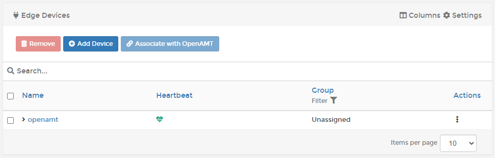
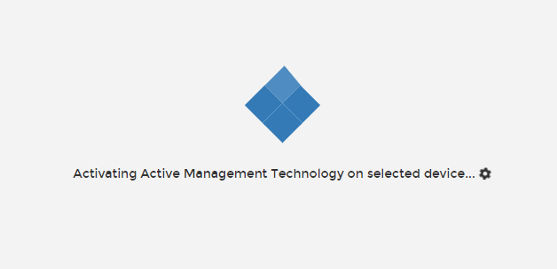
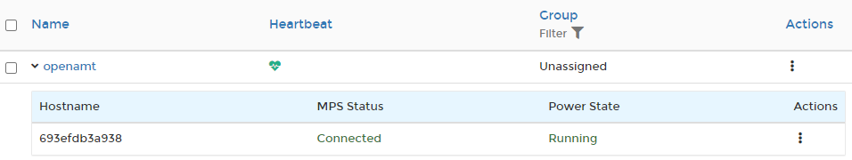
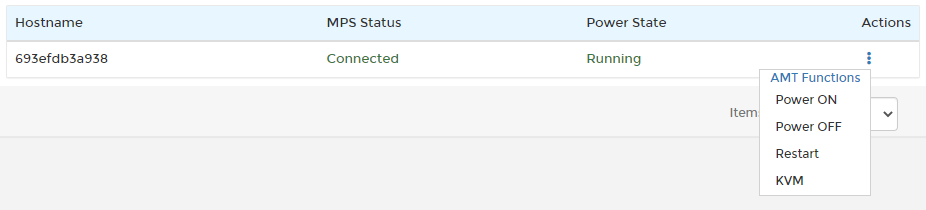

# OpenAMT

OpenAMT allows you to remotely manage your compatible Edge devices from Portainer, letting you start, stop, restart and access the device console directly from within the Portainer UI.

## Preparation

To associate an Edge device with OpenAMT you must first add a compatible device. To do this, click **Add Device**. If you have Intel FDO enabled you will be asked to select between Provision bare-metal using Intel FDO and Deploy agent manually - make sure you select **Deploy agent manually** and click **Confirm**.

Next, enter the details for your Edge Agent deployment. This is the same process as setting up a regular Edge Agent, so refer to the [Edge Agent instructions](../../../../start/agent/edge.md) for more detail.

Once the Edge Agent has been set up and deployed on the remote device, you will see it appear in the list of Edge Devices with a green heartbeat icon.

The device is now ready to be associated with OpenAMT.

## Associate your device

Check the box next to the device you want to associate, then click the **Associate with OpenAMT** button. You will be asked to confirm your association request, click **Confirm** to do so. The activation process will now begin.

Once activation completes you will be returned to the Edge Devices page. If you now expand the listing for your device (by clicking the arrow next to the name) you will see a list of the associated OpenAMT devices.

## Interact with your device

Once an OpenAMT device has been associated with an Edge Device in Portainer, you are able to interact directly with that device. To do so, go to **Edge Devices** and expand the list of OpenAMT associations for your device by clicking on the arrow next to the device name.

You can perform various actions on the OpenAMT device by clicking the three dots under **Actions** for the association:

* **Power ON**: Will power on the device if it is currently switched off.
* **Power OFF**: Will power off the device if it is currently switched on.
* **Restart**: Will initiate a restart of the device.
* **KVM**: Will open a remote KVM (keyboard, video, mouse) session with the device.
