# General

## Application settings

### Snapshot interval

Defines how often a data snapshot of environments is taken. A data snapshot consists of the information displayed on the home page for the environment as well as other basic information. The default is every 5 minutes.

### Edge agent default poll frequency

This setting defines the default interval used by Edge Agents when checking in with the Portainer instance.

### Use custom logo

Replaces our logo with your own. Toggle on and enter the URL to the logo. The recommended size is 155px by 55px.

### Allow the collection of anonymous statistics

We collect anonymized information about your Portainer installation to help with our product development. You can opt out during installation, or toggle this setting off at any time.&#x20;

<figure>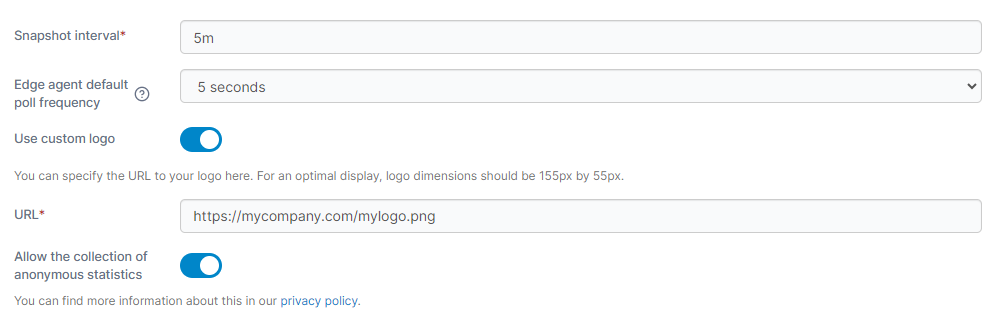<figcaption></figcaption></figure>

### Login screen banner

This setting allows you to specify a custom text banner that will appear on the login screen for all users. This could be used to provide informational detail, a warning message, or whatever you need. To enable this, toggle the **Login screen banner** option on and enter your message in the **Details** box.

<figure><figcaption></figcaption></figure>

Your message will then be shown at the login screen.

<figure>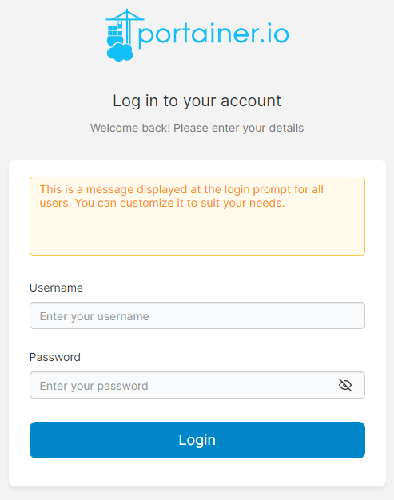<figcaption></figcaption></figure>

### App Templates

You can deploy containers and services using Portainer's set of built-in app templates, or [replace them with your own](../../advanced/app-templates/build.md) set of templates. Once you have a JSON file containing the template definitions, you can provide the URL to it here.

<figure>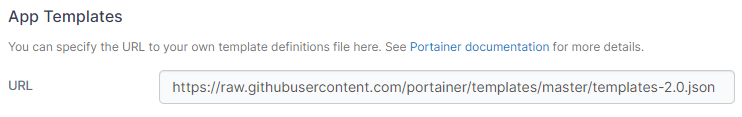<figcaption></figcaption></figure>

## Kubernetes settings

### Helm Repository

If you wish to use your own Helm repository in place of the Bitnami repository we include by default, you can enter the URL here.

<figure>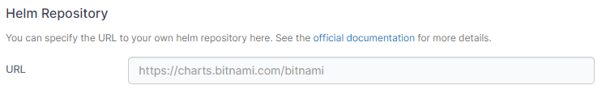<figcaption></figcaption></figure>

### Kubeconfig expiry

Select the expiry time for [exported kubeconfig files](../../user/kubernetes/kubeconfig.md) from this dropdown. The new expiry time will only apply to configurations created after this value was changed.

<figure><figcaption></figcaption></figure>


Tokens used in `kubeconfig` files become invalid when Portainer restarts — irrespective of the value set for **Kubeconfig expiry**. In this case, you will need to re-download the `kubeconfig` file.


### Deployment options

In this section you can configure various Kubernetes-specific deployment options.

| Field/Option                                            | Overview                                                                                                                                                                                                           |
| ------------------------------------------------------- | ------------------------------------------------------------------------------------------------------------------------------------------------------------------------------------------------------------------ |
| Enforce code-based deployment                           | Enable this option to hide the Add with form button when deploying applications and prevent the adding or editing of Kubernetes resources via forms.                                                               |
| Allow web editor and custom template use                | When code-based deployment is enforced, enable this to allow the use of the web editor and custom templates when deploying an application.                                                                         |
| Allow specifying of a manifest via a URL                | When code-based deployment is enforced, enable this allow the use of the URL option when deploying an application.                                                                                                 |
| Allow per-environment override                          | Enable this to allow the above enforcement options to be overridden on a per-environment basis.                                                                                                                    |
| Require a note on applications                          | Enable this to require that deployments have the Notes field completed in order to deploy. This setting currently only applies when deploying via a form.                                                          |
| Allow stacks functionality with Kubernetes environments | Enable this to allow grouping of Kubernetes deployments into "stacks", helping to organize and manage related workloads. Disabling this option will hide the stacks functionality on your Kubernetes environments. |

<figure>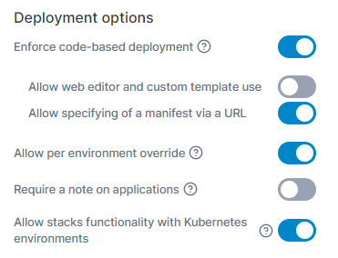<figcaption></figcaption></figure>

## Certificate Authority file for Kubernetes Helm repositories

This section lets you supply a certificate authority (CA) file for use with HTTPS connections to Helm repositories from Portainer. This is useful if the TLS certificate your Helm repository uses is signed by a custom CA, and applies to both the Helm Repository configured above and to Helm repositories configured per environment.


This feature is only available in [Portainer Business Edition](https://www.portainer.io/business-upsell?from=ca-file).


<figure>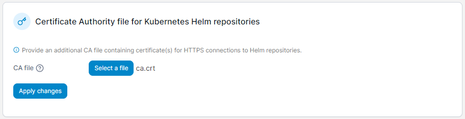<figcaption></figcaption></figure>

## SSL certificate

During installation, Portainer by default creates a self-signed SSL certificate to encrypt traffic between the Portainer Server and the end user, as well as between the Portainer Server and the Portainer Agent. This certificate can be replaced with your own certificate.


We recommend including the full chain in the certificate to ensure compatibility. If you do not have the full chain for your certificate, ask your certificate provider or use [What's My Chain Cert?](https://whatsmychaincert.com/) to generate it.


<figure>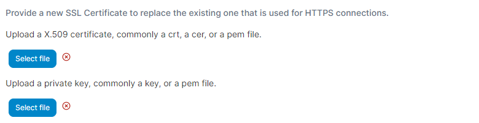<figcaption></figcaption></figure>

### Force HTTPS only

If you have configured your Portainer Server instance to listen on `9443` (HTTPS) and `9000` (HTTP) you can toggle **Force HTTPS only** on to disable listening on port `9000`.


Make sure that your HTTPS configuration is working correctly **before** enabling this option. Failure to do so may result in you being [locked out of your Portainer installation](https://portal.portainer.io/knowledge/i-enabled-force-https-only-and-now-im-locked-out-of-portainer-how-do-i-get-back-in).



Ensure that any Edge agents have been correctly configured for HTTPS communication before enabling this.


<figure>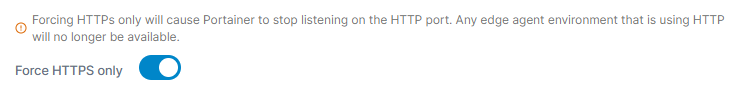<figcaption></figcaption></figure>

After making changes to this section, click **Apply Changes**.

## Experimental features

This section allows you to enable experimental Portainer features for use in your deployment. These features are in early development and have gone through a limited set of testing, and are provided to users in order to gather feedback on the feature at an earlier stage of development.


Enabling experimental features on production deployments should be done cautiously and at your own risk.


| Field/Option              | Overview                                                                                                                                                                                     |
| ------------------------- | -------------------------------------------------------------------------------------------------------------------------------------------------------------------------------------------- |
| Enable OpenAI integration | Toggle this on to enable the OpenAI integration. When this is enabled, individual users will need to add their OpenAI key in their account settings for the feature to be available to them. |

<figure>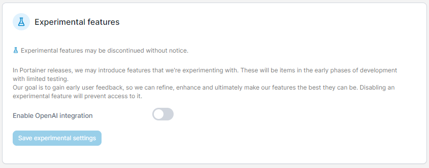<figcaption></figcaption></figure>

## Hidden containers

Stops a container from appearing in the Portainer UI through the container label. Enter the name and value of the label, then click **Add filter**. Containers with matching labels will be hidden.

<figure>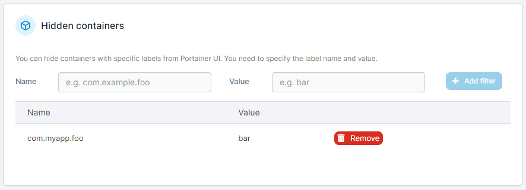<figcaption></figcaption></figure>

## Back up Portainer

This setting contains all of the information that Portainer stores on the `/data` volume, archived in a `tar.gz` file, and is optionally encrypted with a password. This archive is all you need to restore Portainer.

### Backing up to a local disk 

Log in as an admin user. From the menu select **Settings**, then scroll down to the **Back up Portainer** section.

<figure>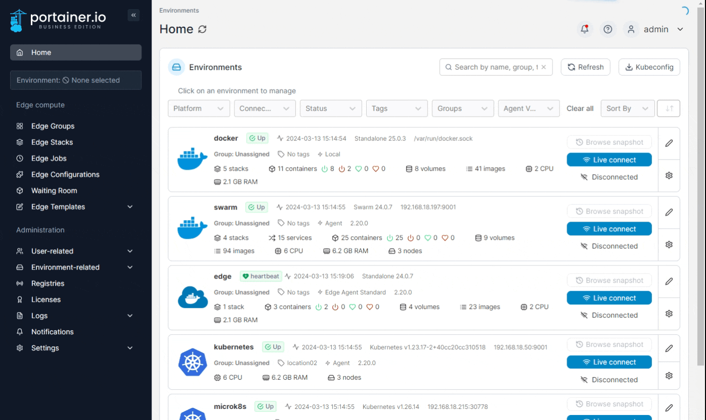<figcaption></figcaption></figure>

**Download backup file** is the default option. As an optional step, toggle **Password protect** on and enter a password to encrypt the backup file. When you click **Download backup**, a `tar.gz` file will be downloaded via the browser.

### Backing up to S3

With Portainer Business Edition you have the option to store a backup of your configuration in an S3 bucket, either on demand or on a defined schedule.

To do this, log in as an admin user, select **Settings** from the menu, then scroll down to **Backup Portainer**.

<figure><figcaption></figcaption></figure>

Select **Store in S3** and fill in the options, using the below as a guide.

| Field/Option               | Overview                                                                                                                                                                                                                                                                                                      |
| -------------------------- | ------------------------------------------------------------------------------------------------------------------------------------------------------------------------------------------------------------------------------------------------------------------------------------------------------------- |
| Schedule automatic backups | Enable this to schedule an automatic backup of your configuration to an S3 bucket.                                                                                                                                                                                                                            |
| Cron rule                  | 
Define how often you want the backup to run using the <a href="https://en.wikipedia.org/wiki/Cron">cron</a> format.

<code>[minute] [hour] [day of month] [month] [day of week]</code>

For example, the following would run a backup at 3:41am every Tuesday:

<code>41 3 * * 2</code>
 |
| Access Key ID              | Enter the access key ID for your S3 bucket.                                                                                                                                                                                                                                                                   |
| Secret Access Key          | Enter the secret key for your S3 bucket.                                                                                                                                                                                                                                                                      |
| Region                     | Enter the region where your bucket is located (for example, `us-west-1`).                                                                                                                                                                                                                                     |
| Bucket name                | Enter the name of your S3 bucket.                                                                                                                                                                                                                                                                             |
| S3 compatible host         | If you are using a non-AWS S3-compatible provider (such as MinIO), enter the URL (including the protocol and port if necessary) here. If you're using AWS S3, leave this blank.                                                                                                                               |
| Password protect           | Enable this to protect your backups with a password.                                                                                                                                                                                                                                                          |
| Password                   | Enter the password to set on your backups.                                                                                                                                                                                                                                                                    |

<figure>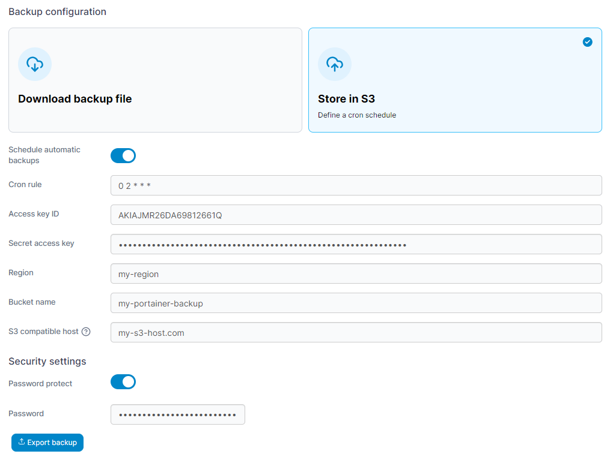<figcaption></figcaption></figure>

### Restoring from a local file

Restoring a configuration is only possible on a fresh instance of Portainer during the initial installation. When you need to restore Portainer, deploy a fresh instance of Portainer with an empty data volume and choose the **Restore Portainer from backup** option during setup.

<figure>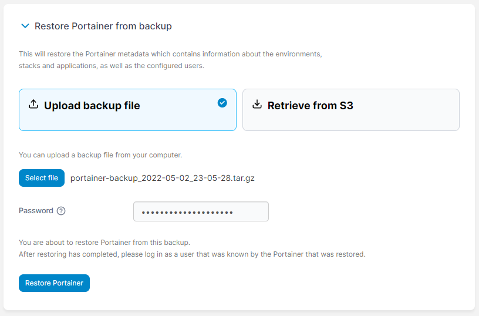<figcaption></figcaption></figure>

On the initialization page, expand **Restore Portainer from backup**. Click **Select file** then browse to and select the `tar.gz` backup file. If the backup was originally encrypted, enter the password then click **Restore Portainer**.

The restore might take a few moments. When it has finished, you will be redirected to the login page. You can now log in with your previous credentials and your previous configuration will be restored.

### Restoring from S3


This feature is only available in Portainer Business Edition.


Restoring a configuration is only possible on a fresh instance of Portainer during the initial installation. When you need to restore Portainer, deploy a fresh instance of Portainer with an empty data volume and choose the **Restore Portainer from backup** option during setup, making sure to select **Retrieve from S3**. Complete the fields using the table below as a guide.

| Field/Option       | Overview                                                                                                                                                                        |
| ------------------ | ------------------------------------------------------------------------------------------------------------------------------------------------------------------------------- |
| Access key ID      | Enter the access key ID for your S3 bucket.                                                                                                                                     |
| Secret access key  | Enter the secret key for your S3 bucket.                                                                                                                                        |
| Region             | Enter the region where your bucket is located (for example, `us-west-1`).                                                                                                       |
| Bucket name        | Enter the name of your S3 bucket.                                                                                                                                               |
| S3 Compatible Host | If you are using a non-AWS S3-compatible provider (such as MinIO), enter the URL (including the protocol and port if necessary) here. If you're using AWS S3, leave this blank. |
| Filename           | Enter the filename of the backup you want to restore.                                                                                                                           |
| Password           | Enter the password set on your backup (if any).                                                                                                                                 |

<figure>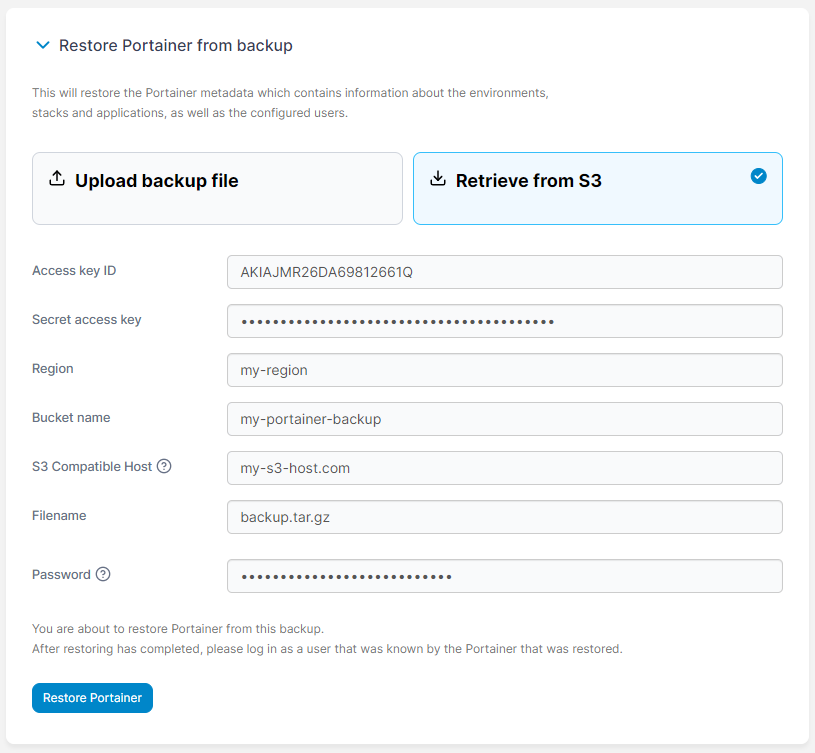<figcaption></figcaption></figure>

When you're ready, click **Restore Portainer**. The restore might take a few moments. When it has finished, you will be redirected to the login page. You can now log in with your previous credentials and your previous configuration will be restored.
