# General

## Application settings

### Snapshot interval

Defines how often a data snapshot of environments is taken. A data snapshot consists of the information displayed on the home page for the environment as well as other basic information. The default is every 5 minutes.

### Edge agent default poll frequency

This setting defines the default interval used by Edge Agents when checking in with the Portainer instance.

### Use custom logo

Replaces our logo with your own. Toggle on and enter the URL to the logo. The recommended size is 155px by 55px.

<figure>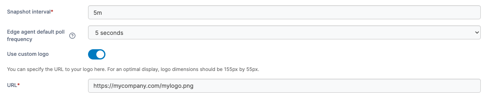<figcaption></figcaption></figure>

### Login screen banner


This feature is only available in [Portainer Business Edition](https://www.portainer.io/business-upsell?from=ca-file).


This setting allows you to specify a custom text banner that will appear on the login screen for all users. This could be used to provide informational detail, a warning message, or whatever you need. To enable this, toggle the **Login screen banner** option on and enter your message in the **Details** box.

<figure>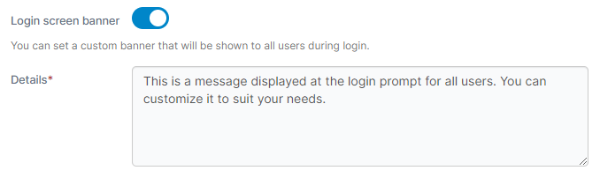<figcaption></figcaption></figure>

Your message will then be shown at the login screen.

<figure>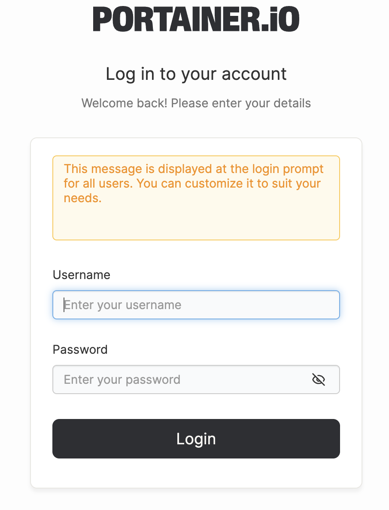<figcaption></figcaption></figure>

### App Templates

You can deploy containers and services using Portainer's set of built-in app templates, or [replace them with your own](../../advanced/app-templates/build.md) set of templates. Once you have a JSON file containing the template definitions, you can provide the URL to it here.

<figure>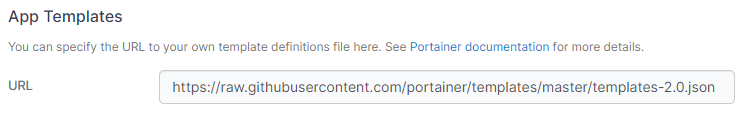<figcaption></figcaption></figure>

### Automatic Portainer patch updates


This is a beta feature and is only available in [Portainer Business Edition](https://www.portainer.io/business-upsell?from=ca-file).



Automatic patch update settings can only be edited by an admin user.



Enabling automatic updates deviates from standard deployment practices where version control is managed externally. This may result in the running version of Portainer becoming out of sync with your deployment manifests or configuration management tools.



This feature is designed for environments where maintaining a high security posture via immediate patching is the priority. It is suitable for standalone Portainer instances where manual maintenance overhead must be minimized.

**When to avoid this feature**

* **Infrastructure as Code (IaC):** If you operate a strict GitOps or IaC workflow, this feature may lead to configuration drift. The running Portainer version will no longer match the version defined in your deployment manifests (e.g. Docker Compose files).
* **Helm Deployments:** Portainer instances deployed via Helm charts are not aware of automatic patching. Reapplying a Helm chart will likely overwrite a patched version, resulting in an unintended rollback to the version specified in the chart.
* **Environmental Consistency:** For environments where containers must remain identical to their tested image (immutability), this feature is not recommended. It introduces a change to the running environment that has not been explicitly triggered by your deployment tools.
* **Change Control:** This feature should be avoided in environments requiring manual validation or staging of all updates before they reach production.


Toggle **Apply patch updates when available** to enable your Portainer version to be automatically updated when a new patch is released. Automatic updates will _only_ apply to patches, for example from 2.35.0 to 2.35.1. Your Portainer version will not automatically update with major or minor releases (2.35.0 to 2.36.0 for example).

Specify the time you want Portainer to check for new updates each day, the time specified is UTC.


Update checks only start **one hour after enabling**. The first check runs at the next scheduled check time that is **at least one hour later**.


By default, Portainer retrieves update images from Docker Hub. You can override this by selecting **Use** **custom registry**, which tells Portainer to use your own image registry. This option is useful for environments that mirror Portainer images internally, operate within air-gapped networks, or restrict direct internet access for security and compliance reasons.

When specifying a custom registry, the following fields are mandatory:

| Field/Option               | Overview                                                                                                                                                                                                                         |
| -------------------------- | -------------------------------------------------------------------------------------------------------------------------------------------------------------------------------------------------------------------------------- |
| Registry                   | The address of your custom image registry, selected from your existing Portainer registries.                                                                                                                                     |
| Portainer image repository | The repository for the Portainer image (for example, `myrepo/portainer-ee`).                                                                                                                                                     |
| Updater image repository   | 
The repository for the Portainer updater image used to perform the update (for example, <code>myrepo/portainer-updater</code>).

The updater repository must exist in the same registry as the Portainer repository.
 |

<figure>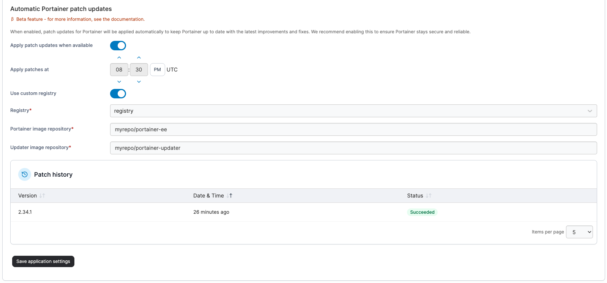<figcaption></figcaption></figure>

Any patches that have been applied will display in the **Patch history** table, showing the version, the date the patch was applied, and a status of **In Progress**, **Succeeded** or **Failed**.

## Kubernetes settings

### Helm Repository

If you wish to use your own Helm repository in place of the Bitnami repository we include by default, you can enter the URL here.

<figure>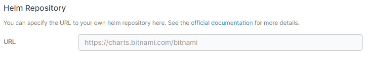<figcaption></figcaption></figure>

### Kubeconfig

Here you can select the expiry time for [exported kubeconfig files](../../user/kubernetes/kubeconfig.md) from this dropdown. The new expiry time will only apply to configurations created after this value was changed. Administrators are also able to disable Kubeconfig download for non-admin users here.

<figure>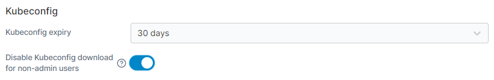<figcaption></figcaption></figure>


Tokens used in `kubeconfig` files become invalid when Portainer restarts — irrespective of the value set for **Kubeconfig expiry**. In this case, you will need to re-download the `kubeconfig` file.


### KubeShell

This option lets administrators disable KubeShell access for non-admin users.

<figure>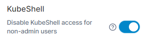<figcaption></figcaption></figure>

### Deployment options

In this section you can configure various Kubernetes-specific deployment options.

| Field/Option                                            | Overview                                                                                                                                                                                                           |
| ------------------------------------------------------- | ------------------------------------------------------------------------------------------------------------------------------------------------------------------------------------------------------------------ |
| Enforce code-based deployment                           | Enable this option to hide the Add with form button when deploying applications and prevent the adding or editing of Kubernetes resources via forms.                                                               |
| Allow web editor and custom template use                | When code-based deployment is enforced, enable this to allow the use of the web editor and custom templates when deploying an application.                                                                         |
| Allow specifying of a manifest via a URL                | When code-based deployment is enforced, enable this allow the use of the URL option when deploying an application.                                                                                                 |
| Allow per-environment override                          | Enable this to allow the above enforcement options to be overridden on a per-environment basis.                                                                                                                    |
| Require a note on applications                          | Enable this to require that deployments have the Notes field completed in order to deploy. This setting currently only applies when deploying via a form.                                                          |
| Allow stacks functionality with Kubernetes environments | Enable this to allow grouping of Kubernetes deployments into "stacks", helping to organize and manage related workloads. Disabling this option will hide the stacks functionality on your Kubernetes environments. |

<figure>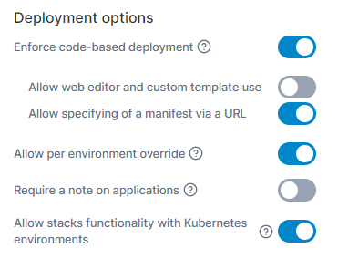<figcaption></figcaption></figure>

## Certificate Authority file for Kubernetes Helm repositories


This feature is only available in [Portainer Business Edition](https://www.portainer.io/business-upsell?from=ca-file).


This section lets you supply a certificate authority (CA) file for use with HTTPS connections to Helm repositories from Portainer. This is useful if the TLS certificate your Helm repository uses is signed by a custom CA, and applies to both the Helm Repository configured above and to Helm repositories configured per environment.

<figure>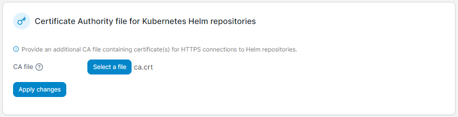<figcaption></figcaption></figure>

## SSL certificate

### Force HTTPS only

If you have configured your Portainer Server instance to listen on `9443` (HTTPS) and `9000` (HTTP) you can toggle **Force HTTPS only** on to disable listening on port `9000`.


Make sure that your HTTPS configuration is working correctly **before** enabling this option. Failure to do so may result in you being [locked out of your Portainer installation](https://portal.portainer.io/knowledge/i-enabled-force-https-only-and-now-im-locked-out-of-portainer-how-do-i-get-back-in).



Ensure that any Edge Agents have been correctly configured for HTTPS communication before enabling this. This setting does **not** affect Standard Agent deployments, as these use HTTPS certificates generated by the Agent on installation.


<figure>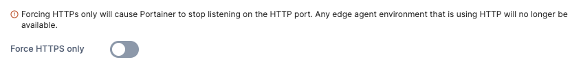<figcaption></figcaption></figure>

### Force Secure cookies&#x20;


Use the **Force secure cookies** feature with caution. Forcing secure cookies when accessing Portainer over plain HTTP will break Portainer login entirely.


Use this setting to force the `Secure` attribute on all authentication cookies. This ensures compliant cookie behavior in deployments behind reverse proxies or ingress controllers that terminate TLS. &#x20;

<figure>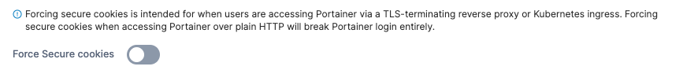<figcaption></figcaption></figure>

### Provide a new SSL certificate

During installation, Portainer by default creates a self-signed SSL certificate to encrypt traffic between the Portainer Server and the end user, as well as between the Portainer Server and the Portainer Agent. This certificate can be replaced with your own certificate.


Note that SSL certificates [specified by CLI options](../../advanced/cli.md#configuration-flags-available-at-the-command-line) will override any certificates uploaded here.



We recommend including the full chain in the certificate to ensure compatibility. If you do not have the full chain for your certificate, ask your certificate provider or use [What's My Chain Cert?](https://whatsmychaincert.com/) to generate it.


<figure>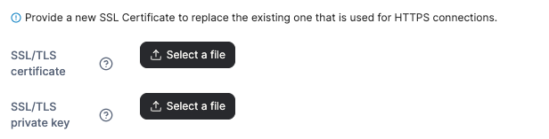<figcaption></figcaption></figure>

After making changes to this section, click **Save SSL settings.**

## Experimental features


This feature is only available in [Portainer Business Edition](https://www.portainer.io/business-upsell?from=ca-file).


This section allows you to enable experimental Portainer features for use in your deployment. These features are in early development and have gone through a limited set of testing, and are provided to users in order to gather feedback on the feature at an earlier stage of development.


Enabling experimental features should be done cautiously and at your own risk.


<figure>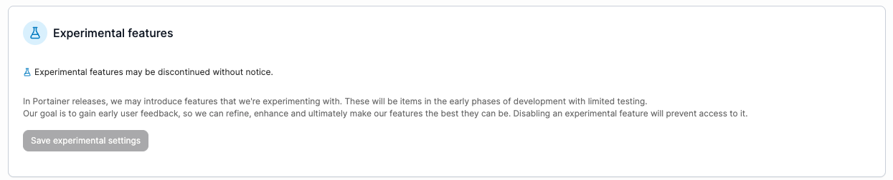<figcaption></figcaption></figure>

## Hidden containers

Stops a container from appearing in the Portainer UI through the container label. Enter the name and value of the label, then click **Add filter**. Containers with matching labels will be hidden.

<figure>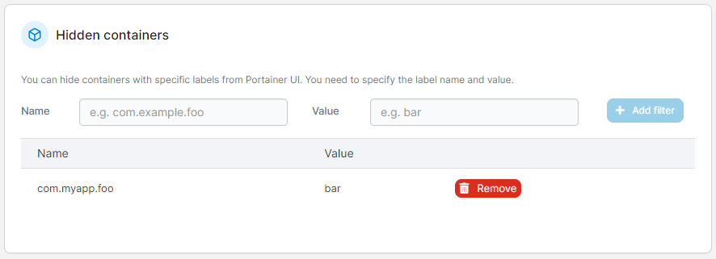<figcaption></figcaption></figure>

## Back up Portainer

There are multiple ways to back up Portainer: by downloading a file to your browser, storing it in S3, or storing it in an Azure Blob. You can also schedule these backups to run on a defined schedule. Performing a backup is only available to admin users.

To access the backup options, select **Settings** from the menu, then scroll down to **Back up Portainer**.


This backup is **only** intended to back up the Portainer configuration. It does **not** back up what you have deployed on your environments (for example, containers, stacks, services, volumes, etc). For more information on what is included in your backup, see [this FAQ](../../faqs/getting-started/what-does-portainers-backup-include.md).&#x20;


<figure>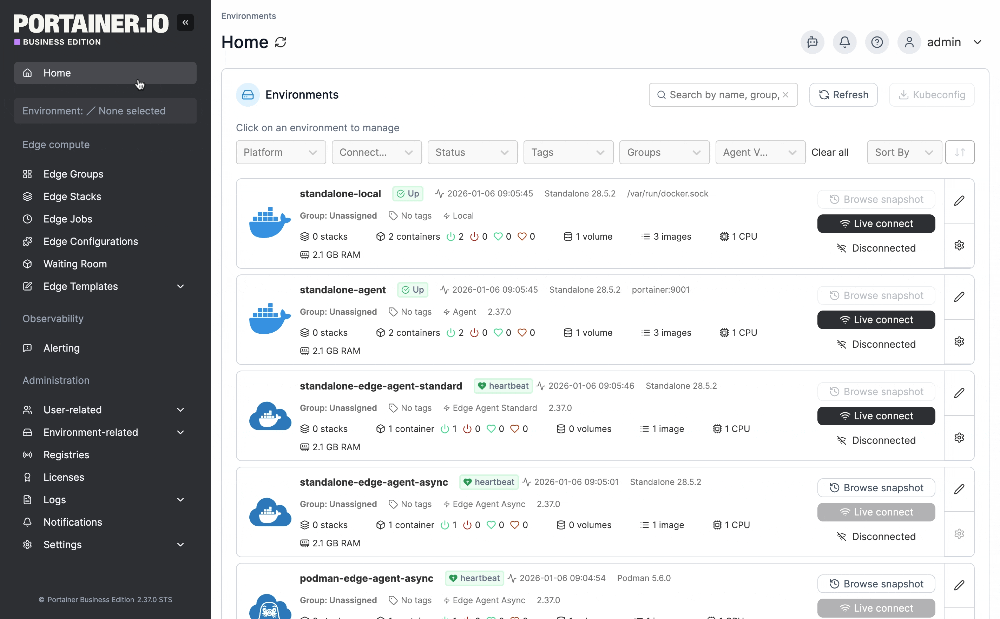<figcaption></figcaption></figure>

### Download backup file 

Use this option to download your backup file directly to your browser. Optionally, toggle **Password protect** on and enter a password to encrypt the file. Click **Download backup** to download a `tar.gz` file.

<figure>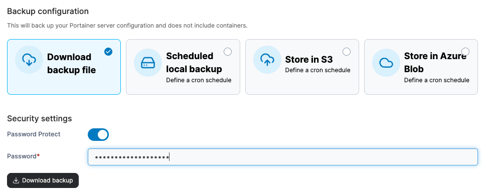<figcaption></figcaption></figure>

### Scheduled local backup


This feature is only available in [Portainer Business Edition](https://www.portainer.io/business-upsell?from=ca-file).


To schedule automatic backups, select **Scheduled local backup** and toggle on **Schedule automatic backups**.

By default, backup archives are written to `/data/scheduled-backups/` inside the Portainer container. To store backups on a separate host volume, mount that volume and point Portainer to it using the `PORTAINER_BACKUP_PATH` environment variable. Note that this path is resolved at startup, so any changes to `PORTAINER_BACKUP_PATH` require a container restart to take effect.

Define your cron rule and set the number of retention days. Set retention days to `0` to keep backups indefinitely. Click **Save backup settings** to save the cron job.

<figure>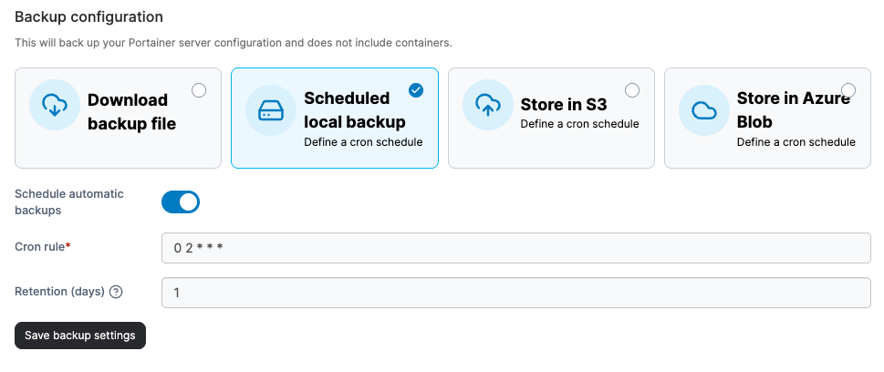<figcaption></figcaption></figure>

### Store in S3


This feature is only available in [Portainer Business Edition](https://www.portainer.io/business-upsell?from=ca-file).


Select **Store in S3** to back up your configuration to an S3 bucket, either on demand or on a defined schedule.

Fill in the fields using the guide below.

| Field/Option               | Overview                                                                                                                                                                                                                                                                                                      |
| -------------------------- | ------------------------------------------------------------------------------------------------------------------------------------------------------------------------------------------------------------------------------------------------------------------------------------------------------------- |
| Schedule automatic backups | Enable this to schedule an automatic backup of your configuration to an S3 bucket.                                                                                                                                                                                                                            |
| Cron rule                  | 
Define how often you want the backup to run using the <a href="https://en.wikipedia.org/wiki/Cron">cron</a> format.

<code>[minute] [hour] [day of month] [month] [day of week]</code>

For example, the following would run a backup at 3:41am every Tuesday:

<code>41 3 * * 2</code>
 |
| Access Key ID              | Enter the access key ID for your S3 bucket. Leave this field blank to allow the AWS SDK to resolve credentials from the environment, for example via IAM Roles for Service Accounts (IRSA) when running in EKS.                                                                                               |
| Secret Access Key          | Enter the secret key for your S3 bucket. Leave this field blank to allow the AWS SDK to resolve credentials from the environment, for example via IAM Roles for Service Accounts (IRSA) when running in EKS.                                                                                                  |
| Region                     | Enter the region where your bucket is located (for example, `us-west-1`).                                                                                                                                                                                                                                     |
| Bucket name                | Enter the name of your S3 bucket.                                                                                                                                                                                                                                                                             |
| S3 compatible host         | If you are using a non-AWS S3-compatible provider (such as MinIO), enter the URL (including the protocol and port if necessary) here. If you're using AWS S3, leave this blank.                                                                                                                               |
| Password protect           | Enable this to protect your backups with a password.                                                                                                                                                                                                                                                          |
| Password                   | Enter the password to set on your backups.                                                                                                                                                                                                                                                                    |

<figure>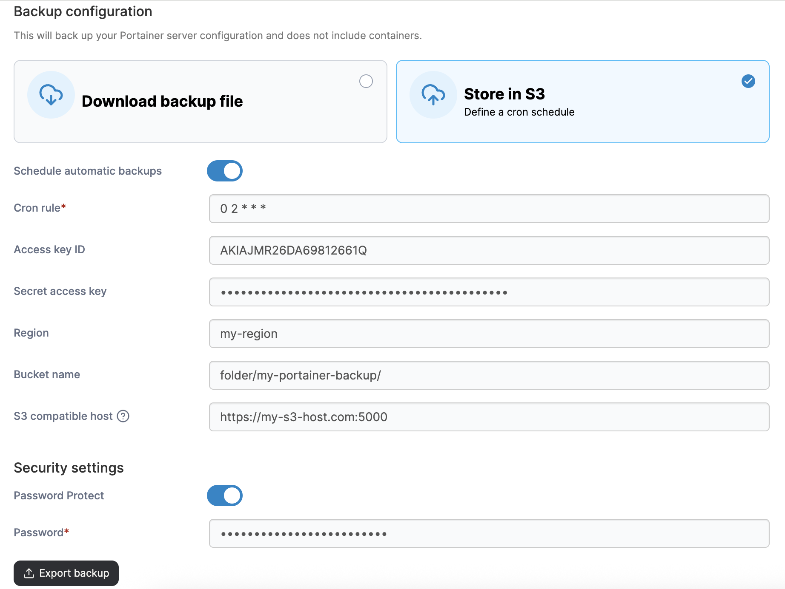<figcaption></figcaption></figure>

Once the fields are complete, select **Export backup** to immediately start a backup, or **Save backup settings** to save your configuration and activate any scheduled backups.

### Store in Azure Blob


This feature is only available in [Portainer Business Edition](https://www.portainer.io/business-upsell?from=ca-file).


Select **Store in Azure Blob** to back up your configuration to an Azure Blob, either on demand or on a defined schedule.

Fill in the fields using the guide below.

| Field/Option               | Overview                                                                                                                                                                                                                                                                                                      |
| -------------------------- | ------------------------------------------------------------------------------------------------------------------------------------------------------------------------------------------------------------------------------------------------------------------------------------------------------------- |
| Schedule automatic backups | Enable this to schedule an automatic backup of your configuration to an S3 bucket.                                                                                                                                                                                                                            |
| Cron rule                  | 
Define how often you want the backup to run using the <a href="https://en.wikipedia.org/wiki/Cron">cron</a> format.

<code>[minute] [hour] [day of month] [month] [day of week]</code>

For example, the following would run a backup at 3:41am every Tuesday:

<code>41 3 * * 2</code>
 |
| Storage account name       | Enter the name of the Azure Blob Storage account where backups will be stored.                                                                                                                                                                                                                                |
| Container name             | Enter the name of the Azure Blob Storage container where backups will be stored.                                                                                                                                                                                                                              |
| Authentication method      | Select how Portainer will authenticate with Azure. Options are Service Principal (Secret), Service Principal (Certificate), Managed Identity, and Storage Account Key. The fields below will update based on your selection.                                                                                  |



**Tenant ID:** Enter the Tenant ID for your Azure service principal.

**Client ID:** Enter the Client ID for your Azure service principal.

**Client secret:** Enter the Client Secret for your Azure service principal.

**Service URL:** Enter a custom endpoint URL if you are using a sovereign or private Azure environment. Leave blank to use the default Azure endpoint.



**Tenant ID:** Enter the Tenant ID for your Azure service principal.

**Client ID:** Enter the Client ID for your Azure service principal.

**Client certificate (PFX):** Upload your PFX (PKCS#12) file containing the private key and certificate. Generate this with: `az ad sp create-for-rbac --create-cert`, or convert with: `openssl pkcs12 -export -out cert.pfx -inkey key.pem -in cert.crt` .

**Certificate password:** Enter the certificate password, this can be left blank if there is no password protection on the certificate.



**Managed identity client ID:** Optionally enter the client ID of a user-assigned managed identity. Leave this field blank to use the system-assigned identity.



**Storage account key:** Enter one of the two access keys from the [Azure Portal Storage Account Keys](https://learn.microsoft.com/en-us/azure/storage/common/storage-account-keys-manage?tabs=azure-portal) blade.



| Field/Option       | Overview                                                                                                           |
| ------------------ | ------------------------------------------------------------------------------------------------------------------ |
| Service URL        | Optionally enter a custom Azure Blob Storage endpoint. Leave this field blank to use the standard public endpoint. |
| Password protected | Enable this to protect your backups with a password.                                                               |
| Password           | Enter the password to set on your backups.                                                                         |

<figure>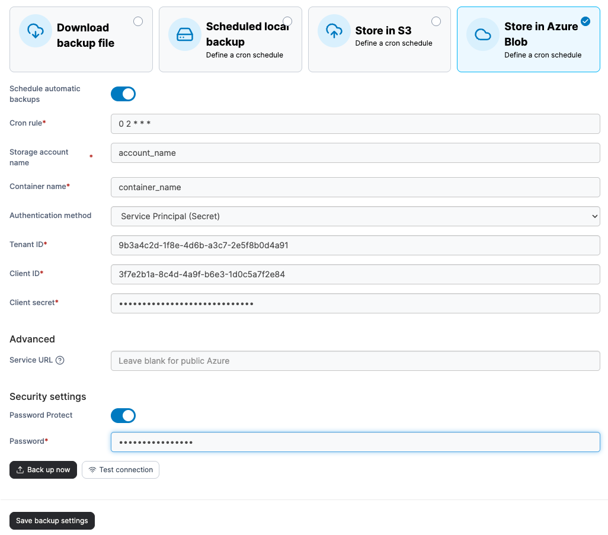<figcaption></figcaption></figure>

Once the fields are complete, select **Back up now** to immediately start a backup, or **Save backup settings** to save your configuration and activate any scheduled backups.

## Restoring Portainer from a backup

### Restoring from a local file

Restoring a configuration is only possible on a fresh instance of Portainer during the initial installation. When you need to restore Portainer, deploy a fresh instance of Portainer with an empty data volume and choose the **Restore Portainer from backup** option during setup.

<figure>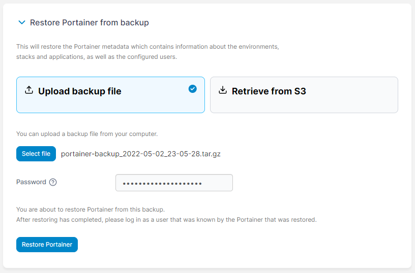<figcaption></figcaption></figure>

On the initialization page, expand **Restore Portainer from backup**. Click **Select file** then browse to and select the `tar.gz` backup file. If the backup was originally encrypted, enter the password then click **Restore Portainer**.

The restore might take a few moments. When it has finished, you will be redirected to the login page. You can now log in with your previous credentials and your previous configuration will be restored.

### Restoring from S3


This feature is only available in Portainer Business Edition.


Restoring a configuration is only possible on a fresh instance of Portainer during the initial installation. When you need to restore Portainer, deploy a fresh instance of Portainer with an empty data volume and choose the **Restore Portainer from backup** option during setup, making sure to select **Retrieve from S3**. Complete the fields using the table below as a guide.

| Field/Option       | Overview                                                                                                                                                                        |
| ------------------ | ------------------------------------------------------------------------------------------------------------------------------------------------------------------------------- |
| Access key ID      | Enter the access key ID for your S3 bucket.                                                                                                                                     |
| Secret access key  | Enter the secret key for your S3 bucket.                                                                                                                                        |
| Region             | Enter the region where your bucket is located (for example, `us-west-1`).                                                                                                       |
| Bucket name        | Enter the name of your S3 bucket.                                                                                                                                               |
| S3 Compatible Host | If you are using a non-AWS S3-compatible provider (such as MinIO), enter the URL (including the protocol and port if necessary) here. If you're using AWS S3, leave this blank. |
| Filename           | Enter the filename of the backup you want to restore.                                                                                                                           |
| Password           | Enter the password set on your backup (if any).                                                                                                                                 |

<figure>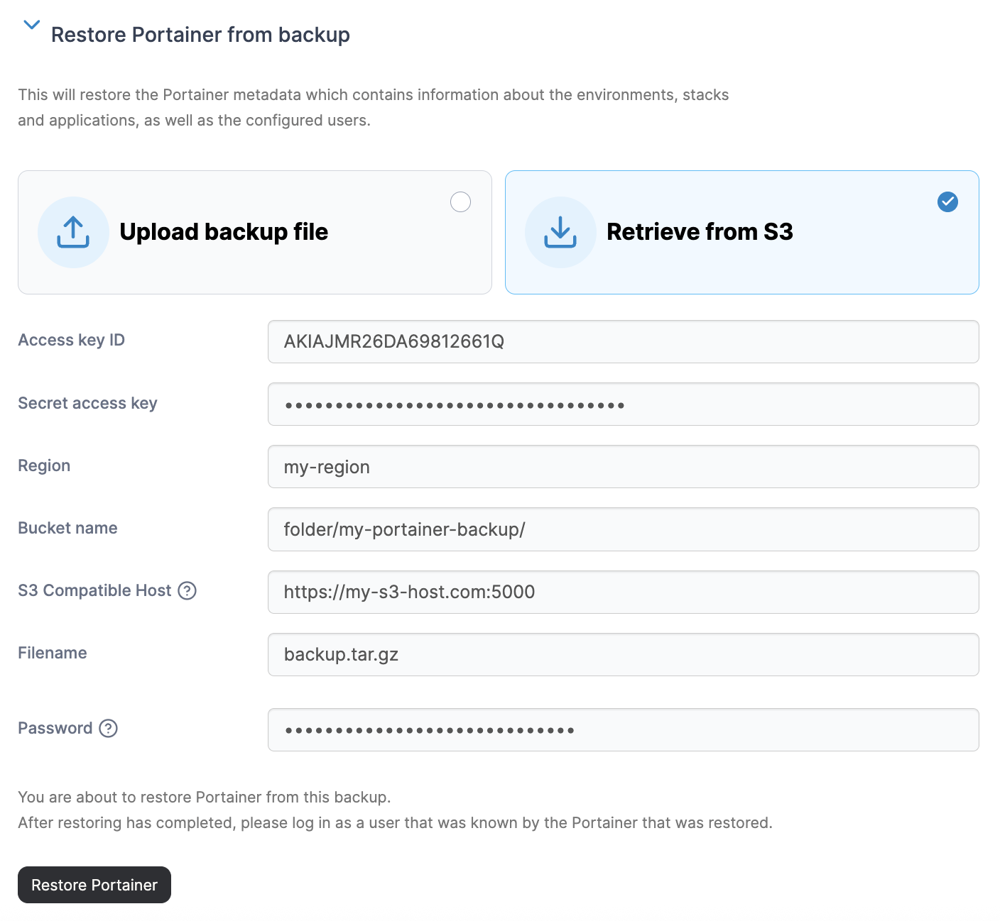<figcaption></figcaption></figure>

When you're ready, click **Restore Portainer**. The restore might take a few moments. When it has finished, you will be redirected to the login page. You can now log in with your previous credentials and your previous configuration will be restored.

## Portainer support


This feature is only available in [Portainer Business Edition](https://www.portainer.io/business-upsell?from=ca-file).


In this section you will find settings related to troubleshooting your Portainer installation.

### Support bundle

This functionality allows you to collect information about your Portainer installation in a bundle that can then be provided to the Portainer support team to aid in troubleshooting issues. Personal information such as passwords and other sensitive credentials are removed from this bundle before being generated.

You can optionally choose to password protect the bundle by toggling on **Password Protect** and setting a password. If you do choose to set a password, ensure you provide the password to the Portainer support team when you supply the bundle.

<figure>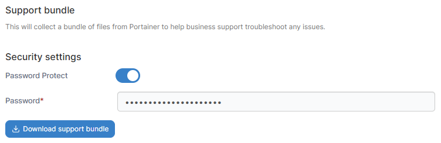<figcaption></figcaption></figure>

Click **Download support bundle** to generate and download a .tar.gz file containing the bundle.

### Debug log

Toggle **Enable debug log** on to enable debug logging in the Portainer container logs. Debug logging can help with troubleshooting issues by providing a more verbose output.

<figure>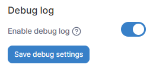<figcaption></figcaption></figure>
