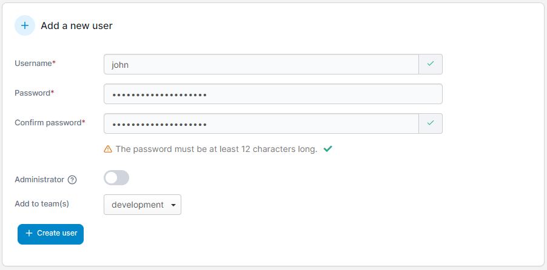

# Add a new user

From the menu expand **User-related** and select **Users**.&#x20;

<figure><figcaption></figcaption></figure>

Enter a username and a strong password (and confirm it). You can also set whether this user is an Administrator as well as add the user to any teams you have created.&#x20;

<figure><figcaption></figcaption></figure>

Once you're ready, click **Create user**.
