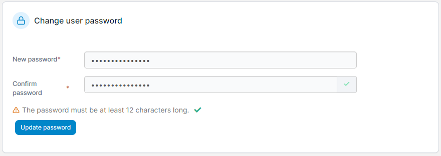

# Reset a user's password

From the menu expand **User-related** then select **Users**.&#x20;

<figure><figcaption></figcaption></figure>

Click the username of the user whose password you want to reset. In the **Change user password** section, enter a new strong password, re-enter the password to confirm it then click **Update password**.

<figure><figcaption></figcaption></figure>
