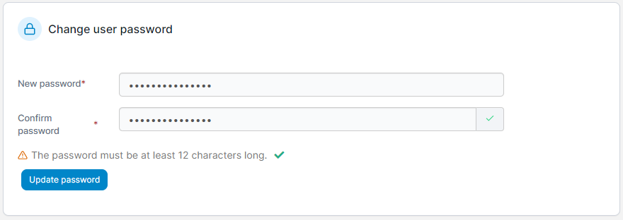

---
metaLinks:
  alternates:
    - https://app.gitbook.com/s/Dalese9Lv4CX6YKS1s45/admin/user/password
---

# Reset a user's password

From the menu expand **User-related** then select **Users**.

<figure><figcaption></figcaption></figure>

Click the username of the user whose password you want to reset. In the **Change user password** section, enter a new strong password, re-enter the password to confirm it then click **Update password**.

<figure><figcaption></figcaption></figure>
