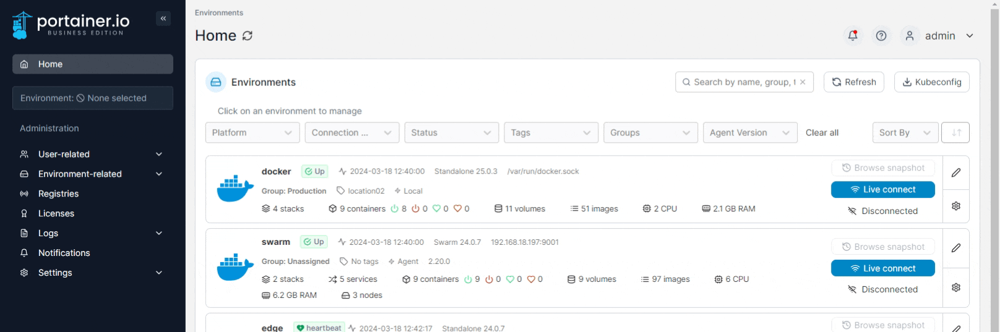
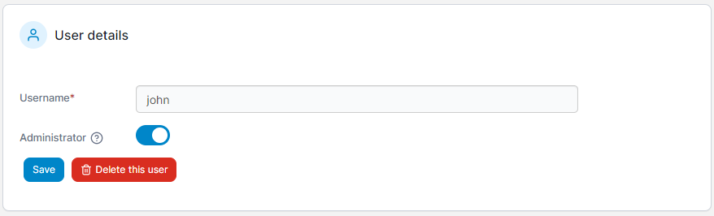

# Turn a user into an administrator

From the menu expand **User-related** then select **Users**.&#x20;

<figure><figcaption></figcaption></figure>

Click the username of the user you want to promote to administrator. Toggle **Administrator** on then click **Save**.

<figure><figcaption></figcaption></figure>
