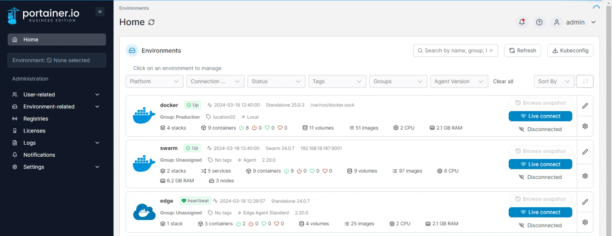
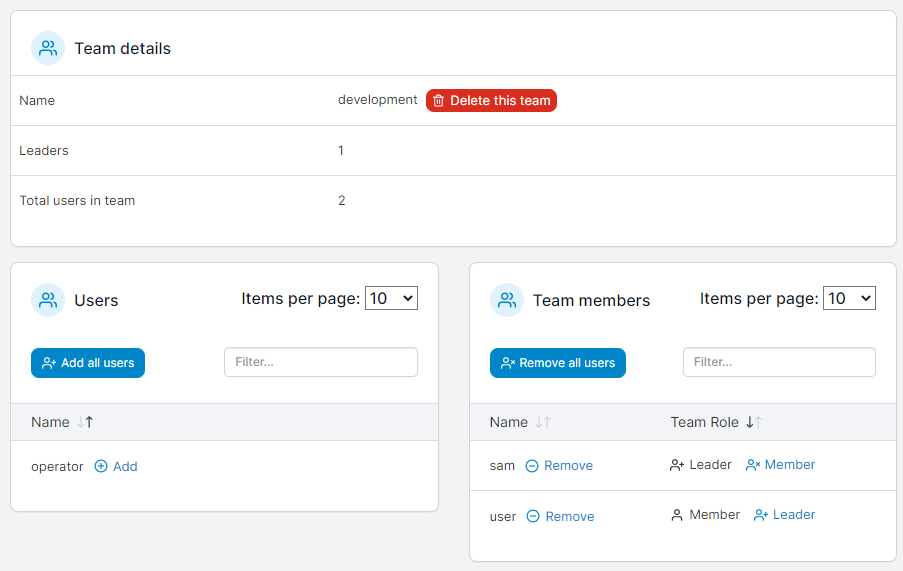

# Add a user to a team

From the menu expand **User-related** then select **Teams**.&#x20;

<figure><figcaption></figcaption></figure>

Select the team you want to add users to then click **Add** next to the user.

<figure><figcaption></figcaption></figure>
