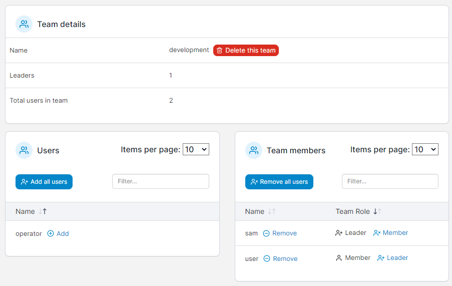

---
metaLinks:
  alternates:
    - https://app.gitbook.com/s/j6QEqM3Sd94bdPsX4HaN/admin/user/teams/add-user
---

# Add a user to a team

From the menu expand **User-related** then select **Teams**.&#x20;

<figure><figcaption></figcaption></figure>

Select the team you want to add users to then click **Add** next to the user.

<figure><figcaption></figcaption></figure>
