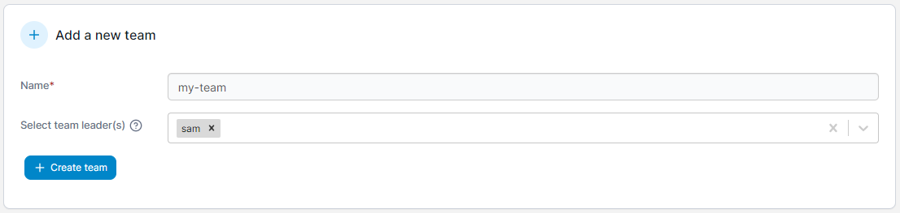

# Add a new team

From the menu expand **User-related** then select **Teams**.&#x20;

<figure><figcaption></figcaption></figure>

Enter the name of the team and optionally select team leaders. Team leaders can add and remove existing users to and from their team, as well as promote existing team members to co-team leaders.


If your Portainer installation uses external authentication and teams are synced from your external authentication provider, the team leader role is disabled.


<figure><figcaption></figcaption></figure>

When you're ready, click **Create team**.
