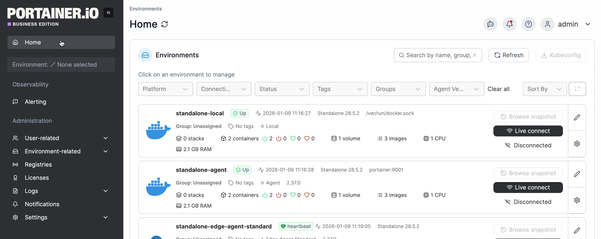
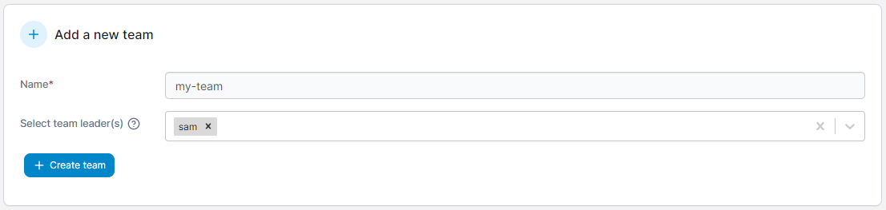
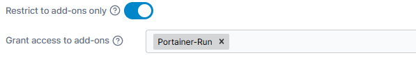

# Add a new team

From the menu expand **User-related** then select **Teams**.

<figure><figcaption></figcaption></figure>

Enter the name of the team and optionally select team leaders. Team leaders can add and remove existing users to and from their team, as well as promote existing team members to co-team leaders.


If your Portainer installation uses external authentication and teams are synced from your external authentication provider, the team leader role is disabled.


<figure><figcaption></figcaption></figure>

If you have any add-ons installed you will see additional options when creating teams:

| Field/Option             | Overview                                                                                                                                                                              |
| ------------------------ | ------------------------------------------------------------------------------------------------------------------------------------------------------------------------------------- |
| Restrict to add-ons only | When this is toggled on, members of this team can only use the add-ons they've been granted. They won't see the Portainer management UI, and will land on an add-on when they log in. |
| Grant access to add-ons  | Select the add-on or add-ons that this team can access.                                                                                                                               |


These options can also be set and changed on teams after creation.


<figure><figcaption></figcaption></figure>

When you're ready, click **Create team**.
