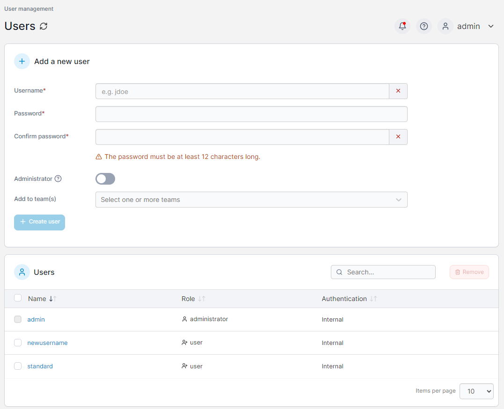

# Users

The **Users** page lists the users configured to access Portainer and allows you to add new users and manage existing users.


For management of user roles in Portainer Business Edition, refer to the [Roles](roles.md) section.


<figure><figcaption></figcaption></figure>


[add.md](add.md)

