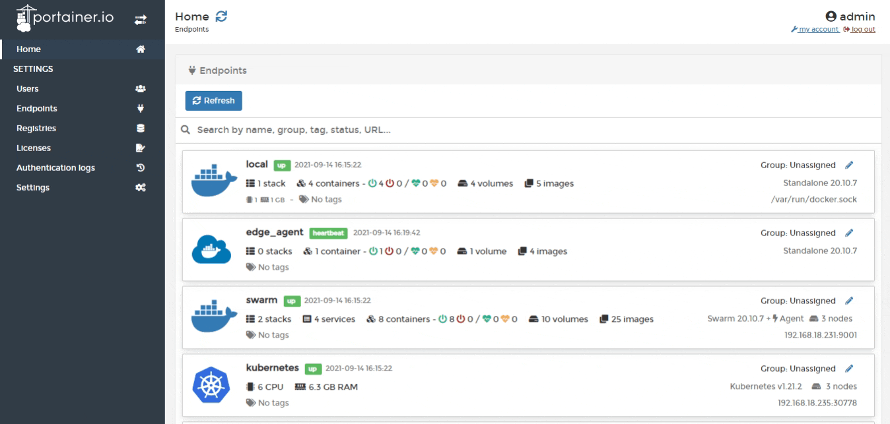
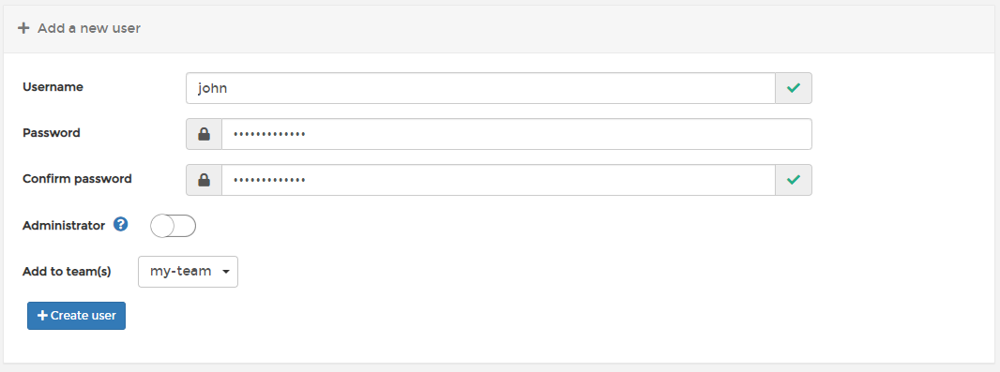

# Add a new user

From the menu select **Users**. 

Enter a username and a strong password \(and confirm it\). You can also set whether this user is an Administrator as well as add the user to any teams you have created. 

Once you're ready, click **Create user**.

